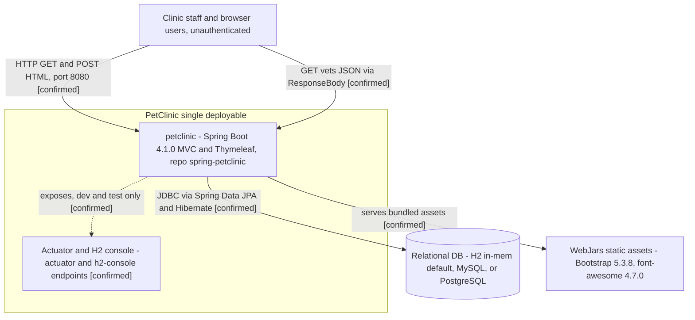
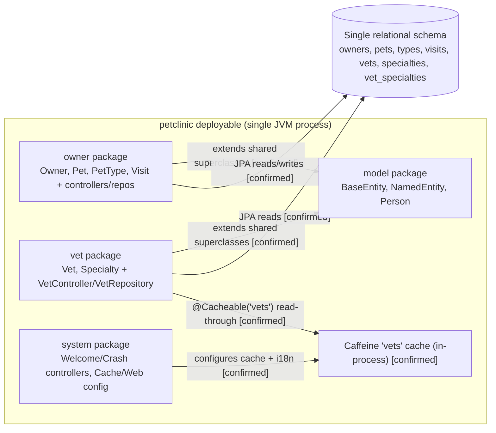
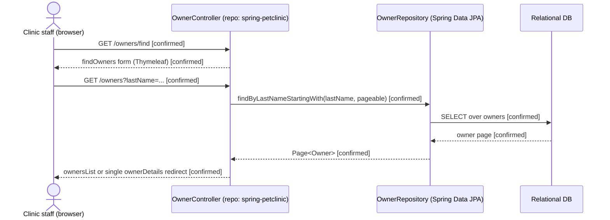
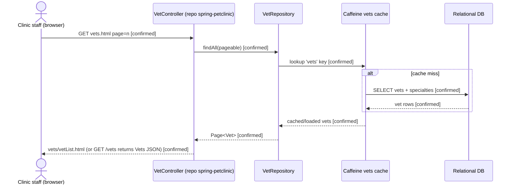
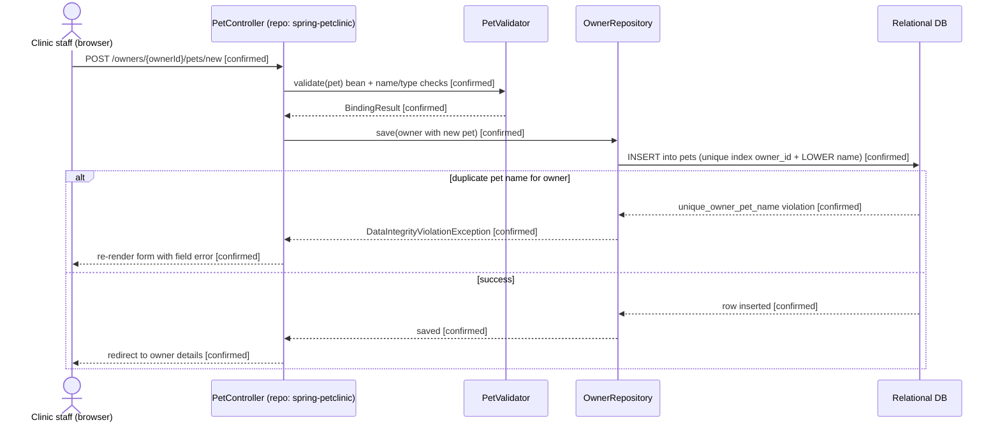
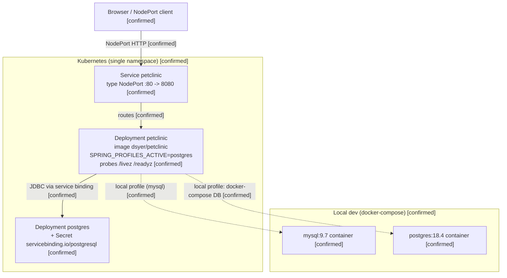
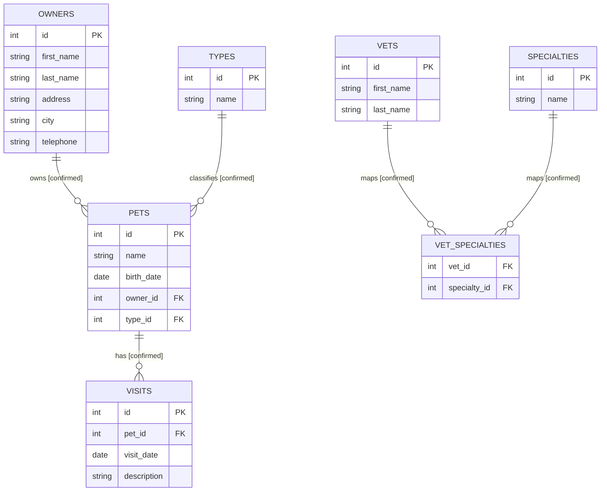

# Architecture Views

> **Evidence basis:** `docs/architecture-inventory/repo-inventory.md`, `docs/architecture-inventory/repo-summary/spring-petclinic.md`. (`docs/architecture-inventory/human-context-notes.md` is **not present**; the only human context supplied by the orchestrator was three `repo_inventory: approved` HOTL responses.) Supplemental non-authoritative context was read from the CAKE catalog (working tenant `5K4DVCTX`) and is used only for §6 intended-state notes — it never creates a diagram element.
> **Confidence legend:** `[confirmed]` = stated in / directly evidenced by inventory, repo summary, or cited code · `[inferred]` = reasonable from partial signals · `[unknown]` = insufficient evidence

> **Scope note:** The workspace contains **one** repository, `spring-petclinic` — a single-deployable Spring Boot 4.1.0 monolith (Kubernetes/Maven name `petclinic`). There are **no** other services, so there is no inter-service call graph, no shared-library divergence, and no cross-service datastore coupling. The diagrams below therefore describe one deployable, its internal package boundaries, its runtime request paths, and its deployment topology. Diagrams depict only code-evidenced elements; anything absent from this clone is not drawn. Catalog-implied-but-unrealized capabilities are captured as a brief gap in §6, and reconciled in detail in the inventory and baseline documents.

---

## 1. System Context Diagrams (C1)

> One bounded context exists: the `petclinic` deployable. It is a server-rendered web application with no third-party service integrations; its only external dependency is a relational database chosen by Spring profile.

**Evidence references:** `README.md`; `pom.xml`, `build.gradle` (`spring-boot-starter-webmvc`, `-thymeleaf`, `-data-jpa`, `postgresql`, `mysql-connector-j`, `h2`, WebJars); `src/main/java/.../PetClinicApplication.java`; controllers under `.../owner/`, `.../vet/`, `.../system/`; `src/main/resources/application.properties` (`management.endpoints.web.exposure.include=*`); `k8s/petclinic.yml` (container port 8080).
**Gaps / unknowns:** No authentication/authorization layer exists in-repo (`[confirmed]` absence of Spring Security); whether an external gateway restricts Actuator/H2 in production is `[unknown]`. WebJars assets are served from within the deployable, not from an external CDN in this clone `[confirmed]`.

---

## 2. Service Dependency Graph

> A platform-level service-to-service graph is **not applicable** — there is exactly one service. The graph below therefore shows the single deployable, its internal Java package modules (logical, not separately deployable), and the single relational schema they share. Module-to-module edges are **logical/packaging** ownership, not remote runtime calls.

**Version divergence observed:** `[not applicable]` — a single deployable with one dependency set; no shared library is consumed across multiple services, so no version divergence exists `[confirmed]`.
**Shared-database topology:** No cross-service shared database or dual-write pattern exists — all domains persist to **one** schema owned by the **one** service `[confirmed]`. The intra-schema foreign keys (`pets.owner_id→owners`, `pets.type_id→types`, `visits.pet_id→pets`, `vet_specialties.vet_id→vets`, `vet_specialties.specialty_id→specialties`) are intra-service relations, not cross-service coupling (`src/main/resources/db/*/schema.sql`).
**Evidence references:** `src/main/java/org/springframework/samples/petclinic/{owner,vet,model,system}/**`; `src/main/java/.../vet/VetRepository.java:45,55` (`@Cacheable("vets")`); `src/main/java/.../system/CacheConfiguration.java`; `docs/architecture-inventory/repo-inventory.md` (Cross-repo relationships).
**Gaps:** None at the service level (single service). The Caffeine cache is in-process, not a networked cache; no Redis/Memcached exists `[confirmed]`.

---

## 3. Runtime Interaction Flows

> Flows are limited to what is evidenced in controllers, repositories, config, and schema. All requests enter over HTTP at port 8080 and are handled by Spring MVC controllers in the same process; there is no gateway, message broker, or downstream service to traverse.

### 3.1 Owner search (HTML) — Confidence: confirmed

**Evidence:** `src/main/java/.../owner/OwnerController.java` (`GET /owners/find`, `GET /owners`, paginated `findPaginatedForOwnersLastName`); `src/main/java/.../owner/OwnerRepository.java` (`findByLastNameStartingWith`); templates `owners/findOwners.html`, `owners/ownersList.html`, `owners/ownerDetails.html`. Search-input normalization referenced in recent commit `bb37aad` ("normalize whitespace in owner search").
**Assumptions / inferences:** none.
**Unknowns:** none.

### 3.2 Veterinarian listing with in-process cache — Confidence: confirmed

**Evidence:** `src/main/java/.../vet/VetController.java` (`GET /vets.html`, `GET /vets` `@ResponseBody Vets`); `src/main/java/.../vet/VetRepository.java:45,55` (`@Cacheable("vets")`); `src/main/java/.../system/CacheConfiguration.java` (`@EnableCaching`, JCache/Caffeine `vets`); `pom.xml` (Caffeine dependency).
**Assumptions / inferences:** The cache read-through ordering (miss → DB load → populate) is Spring's standard `@Cacheable` semantics over the annotated repository; the annotation and cache config are `[confirmed]`, the exact miss/hit branch shown is the framework behavior `[inferred]`.
**Unknowns:** Cache eviction policy/TTL beyond defaults is not specified in-repo `[unknown]`.

### 3.3 Add pet — unique-name constraint handling — Confidence: confirmed

**Evidence:** `src/main/java/.../owner/PetController.java` (~lines 128, 170, `isDuplicatePetNameViolation`); `src/main/java/.../owner/PetValidator.java`; `src/main/resources/db/postgres/schema.sql` (`CREATE UNIQUE INDEX ... ON pets (owner_id, LOWER(name))`), `db/h2/schema.sql` (`UNIQUE (owner_id, name)`); recent commit `88e37c1` (`unique_owner_pet_name` handling). Documented in repo summary §6.
**Assumptions / inferences:** none — both the DB constraint and the in-app catch are cited.
**Unknowns:** none.

**Flows not diagrammed (evidenced absent):** No authentication/session-propagation flow (no Spring Security `[confirmed]`); no multi-tenant routing (single-tenant, no tenant header handling in code `[confirmed]`); no scheduler/cron synchronization; no event-driven/async flow (no broker `[confirmed]`); no cross-service coordination (single service `[confirmed]`).

---

## 4. Deployment Topology

> Derived from `docker-compose.yml`, `k8s/petclinic.yml`, `k8s/db.yml`, and the GitHub Actions workflows. This section may legitimately show provisioned infrastructure (e.g. the MySQL container) even where a runtime edge is not asserted.

**Blue/green or rolling deployment:** `[not observed]` — no Helm chart, no blue/green or canary strategy declared; `k8s/petclinic.yml` is a plain `Deployment` (default rolling update is Kubernetes' implicit behavior, not explicitly configured) `[inferred]`. CI `deploy-and-test-cluster.yml` does a `kubectl apply -f k8s/` against a kind cluster `[confirmed]`.
**Evidence references:** `k8s/petclinic.yml`, `k8s/db.yml`, `docker-compose.yml`, `.github/workflows/{maven-build.yml,gradle-build.yml,deploy-and-test-cluster.yml}`; `README.md` (buildpacks, no Dockerfile).
**Gaps:** Build/publish provenance of image `dsyer/petclinic` is not in-repo (`[unknown]`, ABQ B1). Production ingress/LB, TLS termination, and whether Actuator/H2 are network-restricted in production are not evidenced (`[unknown]`). No autoscaling/HPA manifest present `[confirmed]` absent.

---

## 5. Entity Relationship Views (Partial — Confirmed from schema + JPA)

> Entity evidence is strong: JPA entity classes plus `schema.sql` for H2/MySQL/PostgreSQL. Relationships below reflect declared foreign keys and JPA mappings.

**Evidence:** `src/main/resources/db/{h2,mysql,postgres}/schema.sql`; JPA entities `src/main/java/.../owner/{Owner,Pet,PetType,Visit}.java`, `src/main/java/.../vet/{Vet,Specialty}.java`, `src/main/java/.../model/{BaseEntity,NamedEntity,Person}.java`.
**Confidence per entity:**
- `OWNERS`, `PETS`, `TYPES`, `VISITS`, `VETS`, `SPECIALTIES`, `VET_SPECIALTIES`: **high** — declared in `schema.sql` and mapped by JPA entities.
**Assumptions:** Column lists are representative of the domain fields declared in the entities/schema; some non-key columns are abbreviated for readability `[inferred]`. `vet_specialties` is a join table (`@ManyToMany`) `[confirmed]`.
**Gaps:** The unique constraint `unique_owner_pet_name` (`owner_id` + case-insensitive `name`) is enforced at the DB and in-app but not depicted as an ER relationship (it is a constraint, not an entity link) `[confirmed]`.

---

## 6. Open Questions and Gaps

- **`ownership`** — CAKE holds no repo→service or owning-team mapping for this clone; code ownership beyond authorship is `[unknown]` (inventory Gaps, ABQ B1).
- **`deployment`** — Build/publish pipeline for the `dsyer/petclinic` image is not in-repo; buildpacks (`spring-boot:build-image`) are the likely mechanism per README but unverified `[inferred]`.
- **`operational` / `integration`** — Whether Maven or Gradle is the canonical release path is unstated; both are wired into CI `[unknown]`.
- **`operational`** — Production restriction of the fully-exposed Actuator (`management.endpoints.web.exposure.include=*`) and the H2 console is not evidenced in-repo; assumed dev-only per inline comments `[inferred]`.
- **`operational`** — No Micrometer metrics registry (e.g. Prometheus) and no distributed tracing (OpenTelemetry/Zipkin) dependency exists; if distributed observability is expected it is a gap `[confirmed]` absent.
- **`integration` (gap)** — The catalog references a Virtual Visit / Telehealth capability with no code realization in this clone, so it is not drawn in any diagram. The full catalog-vs-code reconciliation lives in the inventory and baseline documents `[unknown]`.
- **`schema`** — No migration tool (Flyway/Liquibase); schema drift across the three `schema.sql` variants (H2/MySQL/PostgreSQL) is managed manually and could diverge; not independently verified here `[inferred]`.

---

## Assumptions, Blockers & Open Questions

> [!IMPORTANT]
> This document contains unresolved items that require attention before or during implementation. Review and resolve before merging downstream artifacts.

### Assumptions
| # | Assumption | Rationale | Impact if Wrong | Validation Path |
|---|------------|-----------|-----------------|-----------------|
| A1 | The default runtime datastore is in-memory H2 unless a Spring profile overrides it; the Kubernetes deployment uses the `postgres` profile. | `application.properties` sets `database=h2`; `k8s/petclinic.yml` sets `SPRING_PROFILES_ACTIVE=postgres`. | Runtime/ER analysis could target the wrong engine or miss engine-specific schema (e.g. the PostgreSQL functional unique index). | Confirm `SPRING_PROFILES_ACTIVE` per environment. |
| A2 | The §3.2 cache miss/hit branching reflects Spring `@Cacheable` framework semantics. | `@Cacheable("vets")` and Caffeine config are confirmed in code; the internal read-through ordering is standard framework behavior. | A custom cache manager could alter eviction/population order. | Inspect `CacheConfiguration.java` cache-manager settings and Caffeine spec. |
| A3 | Kubernetes rolling update is the effective deployment strategy. | Plain `Deployment` object with no explicit strategy; Kubernetes defaults to RollingUpdate. | If a different strategy is expected (blue/green/canary), release choreography differs. | Confirm with the release/DevOps owner; check for out-of-repo Helm/Argo config. |

### Blockers
| # | Blocker | Blocks | Owner | Resolution Path | Target Date |
|---|---------|--------|-------|-----------------|-------------|
| B1 | Build/publish pipeline for image `dsyer/petclinic` is not in this repository. | Reproducible deployment topology (§4) and image provenance. | Release/DevOps owner | Locate or add the buildpacks image-build + publish pipeline; document the registry. | TBD |
| B2 | No CAKE repo→service/owning-team record for this clone. | Ownership attribution in §2/§6 and downstream graph ingestion. | Platform architecture team | Register the repo→service mapping and owning team in CAKE, or supply it out-of-band. | TBD |

### Open Questions
| # | Question | Why It Matters | Proposed Answer (if any) | Decision Owner |
|---|----------|----------------|--------------------------|----------------|
| Q1 | Is Maven or Gradle the canonical build/release path? | Both are wired into CI; downstream SBOM/native automation must pick one. | — | Platform build owner |
| Q2 | Are the fully-exposed Actuator endpoints and the H2 console network-restricted in production? | Open management/DB surfaces are security-sensitive and affect the §1/§4 boundary. | Assumed dev-only per inline comments; production controls unverified. | Security / platform owner |
| Q3 | Should Micrometer metrics export and/or distributed tracing be added? | No metrics-registry or tracing dependency exists today; affects operational reasoning. | Not present; add only if observability requirements demand it. | Platform / observability owner |
| Q4 | Does the catalog Virtual Visit / Telehealth capability represent planned scope for this platform? | No code realization exists in this clone; the detailed catalog-vs-code reconciliation is tracked in the inventory and baseline documents. | Pending; see inventory/baseline. | Product / architecture owner |
