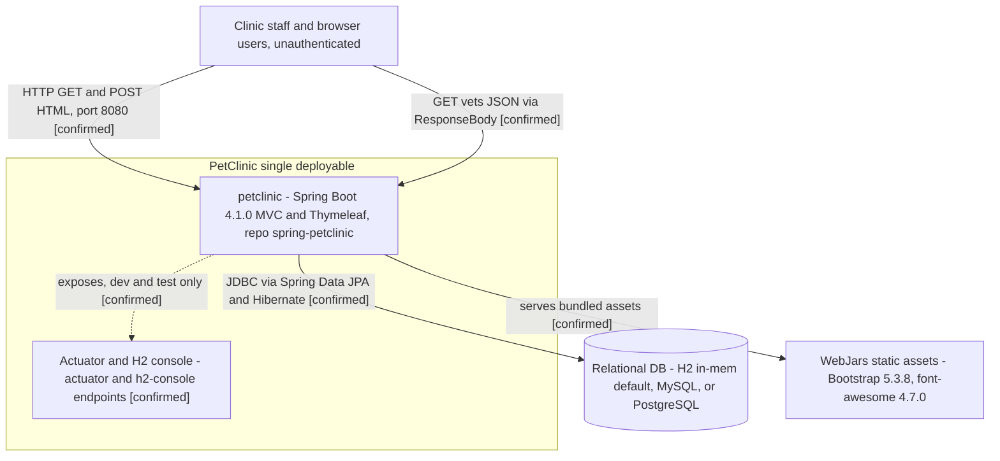
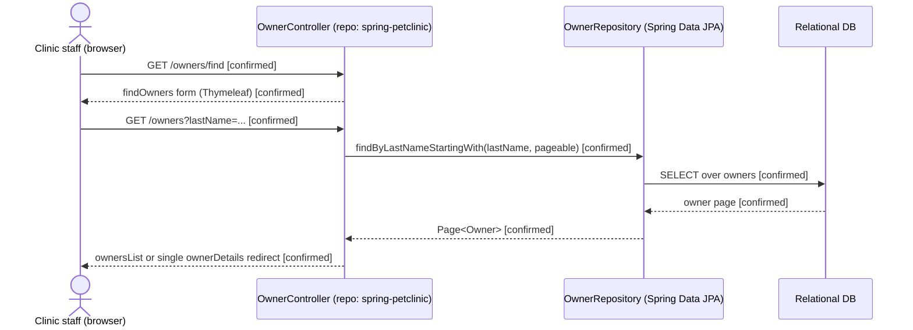

# Architecture Baseline — Petclinic Platform (Evidence-Based, Current-State)

- **Project Key:** VE
- **Project Name:** Petclinic platform
- **Stage:** Architecture discovery — architecture baseline (current-state narrative; canonical reference)
- **Branch:** `arch-discovery-57f5f6e8-e25d-475f-8aeb-42d3fc5622b6`
- **Date:** 2026-08-17
- **Role of this document:** Primary current-state architecture narrative and canonical reference for
  specs, impact analysis, operational review, onboarding, AI-agent grounding, and architecture
  evolution. It **synthesises** the evidence already inventoried in the sibling artifacts rather than
  repeating their tables.

> **Confidence legend:** `[confirmed]` = directly evidenced by runtime/deployment manifests, source
> code, imports, or configuration · `[inference]` = reasonable from partial signals, explicitly
> labelled · `[unknown]` = insufficient evidence.
>
> **Evidence order (strongest first):** (1) runtime/deployment manifests, (2) source & imports,
> (3) configuration, (4) ADRs/repo docs, (5) naming/weak inference (marked as inference). Observed
> facts, inferences, assumptions, and unknowns are kept distinct throughout.

## Inputs and grounding

This baseline is derived **primarily from the cloned `spring-petclinic` repository** and synthesises:

- `docs/architecture-inventory/repo-inventory.md` — 14-dimension evidence-based repo inventory.
- `docs/architecture-inventory/architecture-views.md` — Mermaid C1 context, dependency, runtime-flow,
  deployment, and ER views (the visual source of truth; this document links to and embeds a subset of
  it, and does **not** own or edit it).
- `docs/architecture-inventory/baselines/capability-baseline.md` — the single authoritative capability
  list **and** service→capability ownership mapping (Sections 1–8 + Service Lookup Index). Capability
  descriptions, ownership rows, behavioural constraints, and the requirement-traceability table live
  there and are **referenced, not duplicated**, here.

The workspace contains **one** repository, `spring-petclinic` (git URL
`https://github.com/vinitsri/spring-petclinic`, base ref `feature/VE-216/aidlc`) — a single-deployable
Spring Boot 4.1.0 monolith whose Kubernetes and Maven deployable name is `petclinic`. It is both the
writable artifact/ADR repository (output location `docs/architecture-inventory/`) and the in-scope
subject system.

Supplemental non-authoritative context was read from the CAKE catalog (working tenant `5K4DVCTX`). It
did **not** contribute any current-state fact: the catalog describes a *different* platform (a WebPT
EMR appointment-scheduling modernization program), and that conflict is surfaced explicitly in the
[Source-of-truth conflict](#source-of-truth-conflict-cake-catalog-vs-observed-code) section rather than
reconciled silently. Source code is authoritative throughout.

## Table of contents

1. [Platform overview](#1-platform-overview)
2. [Services and components](#2-services-and-components)
3. [Communication, integration, and persistence patterns](#3-communication-integration-and-persistence-patterns)
4. [Frontend / UI layer](#4-frontend--ui-layer)
5. [Auth and security patterns](#5-auth-and-security-patterns)
6. [Operational topology and deployment/runtime structure](#6-operational-topology-and-deploymentruntime-structure)
7. [Architectural constraints from existing ADRs](#7-architectural-constraints-from-existing-adrs)
8. [Source-of-truth conflict — CAKE catalog vs observed code](#source-of-truth-conflict-cake-catalog-vs-observed-code)
9. [Architecture Views Summary](#architecture-views-summary)
10. [Assumptions, Blockers & Open Questions](#assumptions-blockers--open-questions)

---

## 1. Platform overview

The Petclinic platform is a **single-deployable, server-rendered web application** — one Spring Boot
4.1.0 process (Java 17, Spring MVC + Thymeleaf) that manages a veterinary clinic's owners, pets, pet
types, visits, and veterinarians/specialties `[confirmed]` (`pom.xml`, `build.gradle`,
`src/main/java/org/springframework/samples/petclinic/PetClinicApplication.java`). It is **not** a
distributed system: there is exactly one deployable (`petclinic`), one JVM process, and one relational
schema. Consequently there is **no** service-to-service call graph, message broker, event bus, API
gateway, or cross-service datastore coupling anywhere in the repository `[confirmed]` — an absence
verified across the full source tree, `pom.xml`/`build.gradle` dependency sets, and `k8s/` manifests.

**System boundary.** The boundary of the platform is the `petclinic` deployable. Everything the system
does happens inside that one process; the only things across the boundary are (a) inbound HTTP from
browser/clinic-staff users on container port 8080, (b) an outbound JDBC connection to one relational
database chosen by Spring profile, and (c) bundled static assets (WebJars: Bootstrap 5.3.8,
font-awesome 4.7.0) served from within the deployable rather than an external CDN `[confirmed]`
(`k8s/petclinic.yml` container port 8080; `application.properties`; `pom.xml` WebJars).

**Internal structure.** Within the single JVM, responsibilities are organised by Java **package**
(logical modules, not separately deployable units) under
`org.springframework.samples.petclinic`: `owner`, `vet`, `model`, and `system` `[confirmed]`. These
packages realise the seven capabilities catalogued in `capability-baseline.md` (C1 Pet Owner
Management, C2 Pet & Pet-Type Management, C3 Veterinary Visit Recording, C4 Veterinarian & Specialty
Directory, C5 Clinic Web Presentation & Localization, C6 Relational Persistence & Schema Provisioning,
C7 Platform Operations & Observability). This baseline does not restate those capabilities; it
describes how they coordinate at runtime.

**Runtime coordination (in-process only).** All coordination is method-call coordination inside the
JVM: Spring MVC dispatches an HTTP request to a `@Controller` in the relevant package, which invokes a
Spring Data JPA repository, which issues JDBC against the shared schema `[confirmed]`. The only
runtime "hop" that is not a plain method call is the read-through **in-process Caffeine cache** in
front of the vet listing (`@Cacheable("vets")`), which is a local (non-networked) cache `[confirmed]`
(`vet/VetRepository.java:45,55`, `system/CacheConfiguration.java`). There is no remote coordination to
trace because there is no second process.

**Architectural style (observed).** A classic layered **monolith**: presentation (Thymeleaf views +
Spring MVC controllers) → domain/persistence (JPA entities + repositories) → one relational schema.
The `owner` package is an **aggregate-oriented** module — `Owner` is the aggregate root through which
pets and visits are persisted (`OwnerRepository.save`/`saveAndFlush`), so C1/C2/C3 share code and data
ownership rather than being cleanly separated `[confirmed]` (see `capability-baseline.md` §7). The
`vet` package is the most isolated, read-mostly module `[confirmed]`.

---

## 2. Services and components

There is **one deployable service**: `petclinic` (repo `spring-petclinic`; Kubernetes `Service`/
`Deployment` name `petclinic`; Maven `<name>petclinic</name>`) `[confirmed]` (`k8s/petclinic.yml`,
`pom.xml`). The "components" below are **Java packages / logical modules inside that one JVM**, not
independent services — a distinction that matters for the knowledge graph: no component here has its
own deployable name, so none is renamed. For per-capability ownership and evidence, see
`capability-baseline.md` §2 (Service Ownership Mapping) and its Service Lookup Index.

| Component (package) | Runtime role | Key types | Concern |
|---------------------|--------------|-----------|---------|
| `owner` | HTTP endpoints + persistence for owners, pets, pet types, visits | `OwnerController`, `PetController`, `VisitController`, `Owner`, `Pet`, `PetType`, `Visit`, `OwnerRepository`, `PetValidator`, `PetTypeFormatter` | Business (C1–C3) |
| `vet` | HTTP endpoints (HTML + JSON) for the vet/specialty directory, cache-fronted | `VetController`, `Vet`, `Specialty`, `Vets`, `VetRepository` | Business (C4) |
| `model` | Shared JPA superclasses reused by `owner` and `vet` | `BaseEntity`, `NamedEntity`, `Person` | Shared domain base |
| `system` | Web/app configuration, welcome page, error-demo, caching + i18n wiring | `WelcomeController`, `CrashController`, `WebConfiguration`, `CacheConfiguration` | Platform / cross-cutting (C5, C7) |

**Component coordination (all in-process method calls) `[confirmed]`:**

- `owner` and `vet` controllers depend on their own repositories; both entity families extend the
  `model` superclasses (`Person`/`BaseEntity`/`NamedEntity`) — a **packaging/inheritance** relation,
  not a runtime call between separate services.
- `vet` read paths go through the `system`-configured Caffeine `vets` cache (`@Cacheable`), a local
  in-process cache — the only non-trivial intra-process runtime edge.
- `system` provides application-wide configuration (locale resolution/interceptor, cache manager); it
  is a configuration dependency of the domain packages, exercised at startup and per-request, not a
  business call.

No component calls another **over a network**; there is no second process for any component to call
`[confirmed]` (verified: no HTTP/gRPC client, no message producer/consumer, no service-discovery or
remote-invocation dependency in `pom.xml`/`build.gradle` or source).

---

## 3. Communication, integration, and persistence patterns

**Inbound communication.** One transport only: **synchronous HTTP** on container port 8080, handled by
Spring MVC `@Controller`s `[confirmed]` (`k8s/petclinic.yml`; controllers under `owner/`, `vet/`,
`system/`). Two response styles coexist:

- **Server-rendered HTML** for all user workflows — `GET`/`POST` returning Thymeleaf views
  (`/`, `/owners*`, `/owners/{ownerId}/pets*`, `.../visits/new`, `/vets.html`) `[confirmed]`.
- **One JSON endpoint** — `GET /vets` returns the `Vets` wrapper via `@ResponseBody` `[confirmed]`
  (`vet/VetController.java`). This is the platform's only machine-facing API surface. Additionally,
  Spring Boot Actuator (`/actuator/*`), the diagnostics endpoint `/oups`, the `/h2-console`, and the
  Kubernetes probes `/livez` `/readyz` are exposed `[confirmed]` (`application.properties`,
  `system/CrashController.java`, `k8s/petclinic.yml`).

**Outbound / integration.** The platform integrates with **no third-party services** — no external
HTTP client, SDK, webhook, or SaaS integration exists in code or config `[confirmed]`. Its only
outbound dependency is **JDBC** to a relational database (below). WebJars static assets are bundled
into the deployable, not fetched from an external CDN `[confirmed]`.

**Messaging / async / events.** **None** `[confirmed]` — no SNS/SQS/Kafka/RabbitMQ/EventBridge
dependency, no topic, no producer/consumer, no event store or event bus in code or config. All
processing is synchronous within a single request thread.

**Persistence pattern.** A single relational schema accessed via **Spring Data JPA / Hibernate**,
runnable on **H2** (default, in-memory), **MySQL**, or **PostgreSQL**, selected by Spring profile
`[confirmed]` (`application.properties`, `application-mysql.properties`,
`application-postgres.properties`). Salient, evidenced traits:

- **Schema provisioning without a migration tool** — `spring.jpa.hibernate.ddl-auto=none` plus
  `spring.sql.init` applying per-engine `db/{h2,mysql,postgres}/schema.sql` + `data.sql`; **no Flyway
  or Liquibase** `[confirmed]`. The three hand-maintained SQL variants are a drift risk (see ABQ).
- **Aggregate persistence** — pets and visits are written through the `Owner` aggregate via
  `OwnerRepository`, not through independent pet/visit repositories `[confirmed]`.
- **Database-enforced invariant** — a unique index `unique_owner_pet_name` on
  `(owner_id, LOWER(name))` (PostgreSQL) / `UNIQUE(owner_id, name)` (H2) enforces one pet name per
  owner at the DB level, with the application catching the resulting
  `DataIntegrityViolationException` `[confirmed]` (`owner/PetController.java`, `db/*/schema.sql`).
- **Read-through cache** — the `vets` listing is cached in-process via Caffeine/JCache (`@Cacheable`),
  with JMX statistics enabled `[confirmed]`. This is a local cache, **not** a networked cache; there is
  no Redis/Memcached `[confirmed]`.

Intra-schema foreign keys (`pets.owner_id→owners`, `pets.type_id→types`, `visits.pet_id→pets`,
`vet_specialties.vet_id→vets`, `vet_specialties.specialty_id→specialties`) are intra-service relations
within one owned schema — **not** cross-service coupling `[confirmed]` (`db/*/schema.sql`).

---

## 4. Frontend / UI layer

> A dedicated UI inventory (`docs/architecture-inventory/baselines/ui-inventory.md`) is **not present**
> on this branch (the `baselines/` directory contains only `capability-baseline.md` and this file).
> The UI facts below are therefore stated directly from repository evidence; **gap:** no separate
> ui-inventory artifact exists to summarise/reference (`ownership`/`operational` — UI documentation).

The UI is **fully server-rendered (server-side MPA)** — there is **no SPA, no micro-frontend (MFE), no
client-side JS framework, and no JavaScript build** `[confirmed]`:

- **What renders the initial HTML:** Spring MVC controllers return **Thymeleaf** template names; the
  server renders complete HTML pages per request. Shared chrome comes from Thymeleaf layout fragments
  (`templates/fragments/layout.html`), and pages such as `templates/welcome.html`,
  `templates/owners/*.html`, `templates/pets/*.html`, `templates/vets/vetList.html` `[confirmed]`.
- **JS framework and version:** **none.** There is no `package.json`, no npm/webpack/Vite build, and no
  React/Angular/Vue/Svelte dependency anywhere in the repo `[confirmed]`. Styling is Bootstrap 5.3.8
  and font-awesome 4.7.0 delivered as **WebJars**, with SCSS compiled to `petclinic.css` via libsass at
  build time `[confirmed]` (`pom.xml`, `src/main/scss/*`).
- **Localization:** request-scoped i18n across **11 locales** via a `?lang=` query parameter, using
  `SessionLocaleResolver` + `LocaleChangeInterceptor` and `messages/messages_*.properties`
  `[confirmed]` (`system/WebConfiguration.java`).
- **How user/session context passes from server to client:** context is embedded **directly in the
  server-rendered HTML** — model attributes bound by controllers and rendered by Thymeleaf; the locale
  is held server-side in the HTTP session by `SessionLocaleResolver` `[confirmed]`. There is **no**
  client-side state store, token, or hydration payload, because there is no client framework. There is
  also **no authenticated user/session identity** to pass (see §5) — the app is unauthenticated
  `[confirmed]`.

This corresponds to capability **C5 Clinic Web Presentation & Localization** in
`capability-baseline.md`; see that document for per-capability evidence.

---

## 5. Auth and security patterns

**No application-level authentication or authorization exists** `[confirmed]`. There is no Spring
Security (or equivalent) dependency in `pom.xml`/`build.gradle`, no login flow, no session-based auth,
no role/permission checks, and no tenant/identity handling in any controller `[confirmed]`. Every
endpoint — including the domain pages, the `GET /vets` JSON resource, Actuator, and the H2 console — is
reachable without credentials in this clone.

Security-relevant, evidenced characteristics:

- **Open operational surface (dev-oriented).** Actuator is fully exposed
  (`management.endpoints.web.exposure.include=*`) and the H2 console is enabled; inline configuration
  comments flag these as development/testing conveniences `[confirmed]` (`application.properties`).
  Whether an external layer (ingress/gateway/network policy) restricts them in production is **not
  evidenced in-repo** `[unknown]` (see ABQ).
- **Input-side safeguards that are present** (defensive coding, not authn/authz): controllers disallow
  binding a client-supplied `id` (`setAllowedFields`), enforce an owner-id/path-id match guard on
  update, run Bean Validation (`@NotBlank`, telephone `@Pattern("\\d{10}")`), and use a dedicated
  `PetValidator` `[confirmed]` (`owner/OwnerController.java`, `owner/PetValidator.java`). These are
  correctness/validation controls, catalogued as behavioural constraints in `capability-baseline.md`
  §8 — they are not access control.
- **No secrets in-repo review scope.** DB credentials for MySQL/PostgreSQL are supplied via
  environment/profile configuration and (in Kubernetes) a `servicebinding.io/postgresql` Secret, not
  hard-coded application secrets `[confirmed]` (`k8s/db.yml`, `application-*.properties`,
  `docker-compose.yml`).

The `multi-tenant isolation`, `HIPAA audit`, and identity-header patterns that appear in the CAKE
catalog are **not** realised in this code and are addressed in the
[Source-of-truth conflict](#source-of-truth-conflict-cake-catalog-vs-observed-code) section.

---

## 6. Operational topology and deployment/runtime structure

> Concern separation (Runtime relationship guardrails): this section describes **deployment topology**
> and **provisioned infrastructure**; a deployment relationship here does **not** by itself assert a
> runtime call. Runtime edges are stated only where code/config evidences an active dependency.

**Build & packaging.** The app builds with **both Maven (`pom.xml`) and Gradle (`build.gradle`)**, both
wired into CI; which is canonical for release is unstated `[unknown]` (see ABQ). There is **no
Dockerfile** — the README relies on Cloud Native Buildpacks (`spring-boot:build-image`) `[confirmed]`.
A CycloneDX SBOM plugin and GraalVM native-image support (`native-maven-plugin`,
`PetClinicRuntimeHints.java`) are present `[confirmed]`.

**Local runtime (docker-compose).** `docker-compose.yml` provisions `mysql:9.7` and `postgres:18.4`
containers for local development; the app connects to one of them via the corresponding Spring profile
`[confirmed]`. Both DB containers are provisioned; the **active runtime** DB is whichever profile is
selected (`mysql` or `postgres`) — the other is provisioned-but-unused for that run.

**Kubernetes runtime.** `k8s/petclinic.yml` + `k8s/db.yml` define `[confirmed]`:

- a `Deployment`/`Service` named `petclinic` (image `dsyer/petclinic`), `type: NodePort` mapping
  `:80 → 8080`, with `SPRING_PROFILES_ACTIVE=postgres` and liveness/readiness probes `/livez` `/readyz`;
- a `postgres` `Deployment` plus a `servicebinding.io/postgresql` `Secret`, consumed by the app pod via
  **JDBC service binding** — the one evidenced runtime edge from app → database in the cluster.

**Deployment strategy.** No Helm chart, and no blue/green or canary strategy is declared;
`k8s/petclinic.yml` is a plain `Deployment` (Kubernetes' implicit default is a rolling update, which is
**not** explicitly configured) `[inference]`. No HPA/autoscaling manifest is present `[confirmed]`
absent. CI `deploy-and-test-cluster.yml` performs `kubectl apply -f k8s/` against a kind cluster
`[confirmed]`.

**Image provenance gap.** The manifest references image `dsyer/petclinic`, but the repo contains no
Dockerfile and no image build/publish pipeline for that tag — provenance is **not observable** in this
clone `[unknown]` (see ABQ).

**Observability posture.** Spring Boot Actuator (health/metrics/JMX) is present and JCache statistics
are enabled, but there is **no Micrometer metrics registry** (e.g. Prometheus) and **no distributed
tracing** dependency (OpenTelemetry/Zipkin) `[confirmed]` absent. Logging is SLF4J/Logback defaults.

---

## 7. Architectural constraints from existing ADRs

**No ADRs exist in this repository** `[confirmed]` — there is no `docs/adr/`, `docs/decisions/`, or any
architecture-decision file anywhere in the `spring-petclinic` tree (the only `docs/` content is this
generated `architecture-inventory/` tree). No architectural constraints can be sourced from in-repo
ADRs, and none are invented here.

The constraints that **are** evidenced are enforced by **build tooling and code/config**, not by ADRs:

- **Code-style / hygiene gates** — checkstyle, spring-javaformat, `nohttp`, and the Maven enforcer
  plugin are configured and run in CI `[confirmed]` (`pom.xml`, `.mvn/`, `.github/workflows/`).
- **Supply-chain** — CycloneDX SBOM generation is enabled `[confirmed]`.
- **Runtime invariants** — `ddl-auto=none` (schema never auto-mutated at runtime) and the
  `unique_owner_pet_name` DB constraint are enforced constraints on the persistence layer `[confirmed]`
  (catalogued in `capability-baseline.md` §8).

The ADRs referenced by the CAKE catalog (`ADR-APPLICATION-059`, `ADR-006`, `ADR-PLATFORM-041`, etc.)
belong to a different platform and have **no file or realization in this repository** — see the
[Source-of-truth conflict](#source-of-truth-conflict-cake-catalog-vs-observed-code) section.

---

## Source-of-truth conflict — CAKE catalog vs observed code

Per the mandatory Source-of-Truth rule, this conflict is surfaced explicitly rather than reconciled
silently. It is the same conflict recorded in `repo-inventory.md`, `architecture-views.md` (§6), and
`capability-baseline.md` (Method & grounding) — restated here because this baseline is the canonical
architecture reference.

- **What the catalog claims (tenant `5K4DVCTX`):** an event-sourced, multi-tenant, MFE-based **WebPT
  EMR appointment-scheduling** modernization program. Catalog nodes include capabilities such as
  `Scheduling`, `Appointment Lifecycle Management`, `Calendar Management`, `Provider Availability
  Management`, `Intelligent Slot Generation`, `Waitlist Management`, `Appointment Reminders`,
  `Conversational Scheduling (Eva)`, `multi-tenant isolation`, `HIPAA audit`, and `domain-event
  publishing`; services such as `Scheduler Service`, `Appointment Slot Service`, `Waitlist Service`,
  `Notification Service`, and `Configuration API`; React Micro Frontends
  (`Scheduling MFE`, `@webpt/scheduling-mfe`, `Calendar MFE`); and governing ADRs
  (`ADR-APPLICATION-059`, `ADR-006`, `ADR-PLATFORM-041`, `ADR-007`, `ADR-MULTI-TENANT-DATA-ISOLATION`,
  and others). Verified live via `cake_graph_query` on `2026-08-17`.
- **What the source code shows:** none of it exists in `spring-petclinic`. There is no appointment or
  scheduling domain, no `/v1/*` or `/api/v1/*` API, no event bus/event store, no MFE or JavaScript
  build, no multi-tenant isolation, no auth/audit layer, and no Node.js/React service. The code is a
  server-rendered Spring MVC + Thymeleaf monolith over owners/pets/vets/visits `[confirmed]` (verified
  across `src/main/java/org/springframework/samples/petclinic/**`, `pom.xml`, `build.gradle`, `k8s/`).
- **Resolution (code wins):** the entire CAKE scheduling/EMR model is recorded as **Future/Intended
  State (Not Implemented)** for this repository and is **not** entered as a current-state service,
  capability, runtime edge, or ADR anywhere in this baseline. Whether that program is planned scope for
  this platform is `[unknown]` (a product/architecture decision — ABQ Q1).
- **What does corroborate:** the CAKE *domain narrative* of a veterinary-clinic management application
  (vets/specialties, owners, pets, visits, browse/search) is consistent with the observed code and is
  used only as background, never as the sole basis for a claim.

---

## Architecture Views Summary

> For the complete visual reference, see [`docs/architecture-inventory/architecture-views.md`](../architecture-views.md).

The diagrams in `architecture-views.md` provide Mermaid-based visual representations of:

- **System context (C1):** the single `petclinic` deployable, its unauthenticated users, its bundled
  static assets, and its relational database boundary.
- **Service dependency graph:** since there is exactly one deployable, this shows the internal Java
  package modules (logical, not separately deployable) and the single shared schema — module edges are
  logical/packaging ownership, not remote runtime calls.
- **Runtime interaction flows:** sequence diagrams for owner search, cache-fronted vet listing, and the
  add-pet unique-name flow.
- **Deployment topology:** the Kubernetes `Service`/`Deployment`, the `postgres` deployment + service
  binding, and the local docker-compose DB containers.
- **Entity relationships:** a partial ER diagram derived from JPA entities + `schema.sql`.

### Key diagrams for architecture understanding

Two high-value diagrams are embedded below (a **subset** of `architecture-views.md`, copied verbatim —
no new diagrams are created here). Every edge below was re-checked against the per-edge verification
pass: each is a `[confirmed]` runtime or boundary edge with cited evidence, or (in the context diagram)
a clearly-marked dev/test-only exposure.

*System context (C1): the `petclinic` deployable serves unauthenticated HTTP users, persists over JDBC
to one profile-selected relational database, and serves bundled WebJars assets; Actuator/H2 are
dev/test-only exposures.*

*Runtime flow — owner search (HTML): a representative synchronous request path, all hops in one JVM
process (controller → JPA repository → DB), with no gateway, broker, or downstream service to traverse.*

---

## Assumptions, Blockers & Open Questions

> [!IMPORTANT]
> This document contains unresolved items that require attention before or during implementation. Review and resolve before merging downstream artifacts.

### Assumptions
| # | Assumption | Rationale | Impact if Wrong | Validation Path |
|---|------------|-----------|-----------------|-----------------|
| A1 | `spring-petclinic` is the sole in-scope platform repository and maps 1:1 to the `petclinic` deployable. | Only one clone exists in the workspace; `k8s/petclinic.yml` `metadata.name: petclinic`, Maven `<name>petclinic</name>`. | Missing repos or a mis-mapped deployable name would leave the architecture baseline incomplete or mislink entities in the knowledge graph. | Confirm the request's `repos` list and the deployment registry / CAKE service node with the platform owner. |
| A2 | The default runtime datastore is in-memory H2 unless a Spring profile overrides it; the Kubernetes deployment uses the `postgres` profile. | `application.properties` sets `database=h2`; `k8s/petclinic.yml` sets `SPRING_PROFILES_ACTIVE=postgres`. | Runtime/persistence analysis could target the wrong engine or miss engine-specific schema (e.g. the PostgreSQL functional unique index). | Confirm `SPRING_PROFILES_ACTIVE` per environment. |
| A3 | The fully-exposed Actuator (`*`) and the H2 console are intended for development/testing only. | Inline comments in `application.properties`. | The described operational posture would be a production security exposure. | Verify production config/ingress/network policy with platform/security owner. |
| A4 | Kubernetes rolling update is the effective deployment strategy. | Plain `Deployment` object with no explicit strategy; Kubernetes defaults to RollingUpdate. | If a different strategy (blue/green/canary) is expected, release choreography differs from what this baseline implies. | Confirm with the release/DevOps owner; check for out-of-repo Helm/Argo config. |

### Blockers
| # | Blocker | Blocks | Owner | Resolution Path | Target Date |
|---|---------|--------|-------|-----------------|-------------|
| B1 | Build/publish pipeline for image `dsyer/petclinic` is not in this repository. | Reproducible deployment topology (§6) and image provenance. | Release/DevOps owner | Locate or add the buildpacks image-build + publish pipeline; document the registry. | TBD |
| B2 | No CAKE repo→service / owning-team record for this clone. | Organizational ownership attribution across §2/§6 and downstream knowledge-graph ingestion. | Platform architecture team | Register the repo→service mapping and owning team in CAKE, or supply it out-of-band. | TBD |

### Open Questions
| # | Question | Why It Matters | Proposed Answer (if any) | Decision Owner |
|---|----------|----------------|--------------------------|----------------|
| Q1 | Does the CAKE scheduling/EMR program (Scheduler Service, MFEs, appointment lifecycle, waitlist, HIPAA audit, event sourcing, its ADRs) represent planned future scope for this platform, or is it an unrelated catalog for a different product? | Determines whether a large set of catalog services/capabilities/ADRs are future scope vs out-of-scope noise for this repo. | Not implemented in code; recorded as Future/Intended State (Not Implemented). | Product / architecture owner |
| Q2 | Is Maven or Gradle the canonical build/release path? | Both are wired into CI; downstream SBOM/native-image automation must pick one. | — | Platform build owner |
| Q3 | Are the fully-exposed Actuator endpoints and the H2 console network-restricted in production? | Open management/DB surfaces are security-sensitive and affect the §1/§5/§6 boundary. | Assumed dev-only per inline comments; production controls unverified. | Security / platform owner |
| Q4 | A dedicated UI inventory (`ui-inventory.md`) was not produced on this branch. Should one be authored to formally document the server-rendered UI layer? | §4 states UI facts directly from code; a formal ui-inventory would be the referenced source for downstream UI-facing work. | Not present; author only if UI-facing downstream artifacts require it. | Platform / architecture owner |
| Q5 | Should metrics export (Micrometer/Prometheus) and/or distributed tracing be added? | No metrics-registry or tracing dependency exists today; affects operational reasoning in §6. | Not present; add only if observability requirements demand it. | Platform / observability owner |
