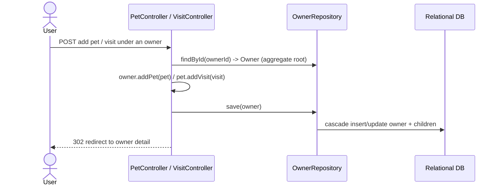

# Pattern: Aggregate-Root Persistence via Spring Data JPA

## Status
Candidate — no explicit approval metadata or ADR exists in the repository to promote this pattern.

## Category
data

## Problem
A cluster of closely related entities must be kept consistent as a unit, but exposing a separate
repository for every child entity spreads the consistency boundary and invites partial, inconsistent
writes.

## Context
In `petclinic`, `Owner` is the aggregate root for a customer's `Pet`s, and each `Pet` owns its `Visit`s.
Pets and visits are added and persisted **through the owner**, not through independent pet/visit
repositories: controllers load the `Owner`, mutate its collections, and call `OwnerRepository.save`.
There is one repository per aggregate root, and child entities have no standalone persistence path.

## When to Use
- Entities form a natural consistency boundary with a clear root (an owner and its pets/visits).
- Child entities have no meaningful lifecycle independent of the root.
- You want writes to the cluster to go through one place so invariants are enforced consistently.

## When Not to Use
- Child entities are queried and mutated independently at high volume and need their own repositories for
  performance or clarity.
- The aggregate would grow so large that loading the root to change one child is wasteful.
- Cross-aggregate transactions dominate (a sign the boundaries are drawn wrong).

## Architecture Summary
Each aggregate root has a Spring Data JPA repository. Child collections are mapped on the root
(`@OneToMany`/`cascade`) and persisted transitively. Controllers operate on the loaded root and save the
root; the ORM cascades inserts/updates to children.

## Structure / Flow

## Key Components
- **Aggregate root** — `owner/Owner.java` (holds the `Pet` collection).
- **Child entities** — `owner/Pet.java` (holds `Visit`s), `owner/Visit.java`.
- **Single aggregate repository** — `owner/OwnerRepository.java` (`save`/`saveAndFlush`, `findById`,
  `findByLastNameStartingWith`).
- **Controllers as the mutation entry point** — `PetController`, `VisitController` load the owner and save
  through it rather than persisting children directly.

## Data / Event / API Contracts
- No separate pet/visit persistence contract is exposed; child writes flow through the owner.
- The read/write contract at the HTTP layer is documented in the API inventory (owner/pet/visit form
  endpoints). No events are produced.

## Naming Conventions
- One repository per aggregate root, named `<Root>Repository`.
- Child collections are mapped on the root entity; child entities are named for their domain noun.

## Service / Boundary Guidance
- The aggregate is the transactional and consistency boundary; keep child mutation inside operations that
  load and save the root.
- Do not introduce a child repository purely to shortcut a write — that reopens the consistency boundary.
- This pattern is what makes the `owner` package own three capabilities (C1–C3) cohesively; see
  [Layered Monolith with Package-Scoped Modules](../domain/layered-monolith-package-modules.md).

## Security / Compliance Considerations
- Routing all writes through the root centralizes where invariants and input validation are applied (see
  [Post-Redirect-Get Form Handling with Bean Validation](../ui/post-redirect-get-form-validation.md)).
- No row-level/tenant isolation exists in-repo; the aggregate is not a security boundary here.

## Observability Considerations
- A single `save(root)` is one logical unit of work, which keeps persistence tracing/logging coherent.
- `open-in-view=false` is set, so lazy access outside the transaction fails fast rather than issuing
  hidden queries during view rendering.

## Failure Handling
- A failed cascade rolls back the whole aggregate save as one transaction.
- Constraint violations surfaced during the cascade (e.g. the unique pet-name index) are caught and
  translated to form errors — see [Layered Uniqueness Enforcement](layered-uniqueness-enforcement.md).

## Trade-offs
- **Gains:** one consistency boundary, transactional integrity of the cluster, fewer repositories,
  invariants enforced in one place.
- **Costs:** loading the whole root to change one child; eager/`@OneToMany` mapping choices affect query
  cost; large aggregates become expensive.

## Variants
- **Lazy vs eager child collections** — tune fetch strategy per read pattern.
- **Dedicated read models** — pair with a read-optimized query/cache path for large child sets (the vet
  read path uses [Read-Through In-Process Cache](read-through-in-process-cache.md), a related read-side idea).

## Anti-patterns
- Persisting child entities through their own repository, bypassing the root and its invariants.
- Anemic roots that expose their collections for external mutation without enforcing rules on save.
- Aggregates so large that most writes touch only a small subtree yet must load everything.

## Evidence
- **ADR:** None — no ADRs exist in the repository.
- **Repo:** `spring-petclinic`.
- **Service:** `petclinic`.
- **File:** `owner/Owner.java` (`@OneToMany` pets), `owner/Pet.java`, `owner/Visit.java`,
  `owner/OwnerRepository.java` (`save`/`saveAndFlush`), `owner/PetController.java`,
  `owner/VisitController.java` (`owners.save(owner)`).
- **API/Event:** owner/pet/visit form endpoints (`docs/architecture-inventory/baselines/api-inventory.md`); no events.
- **Deployment/Config:** `application.properties` `spring.jpa.open-in-view=false`.
- **Notes:** Corroborated by capability-baseline §7 ("pets and visits are persisted through the `Owner` aggregate").

## Related ADRs
None. No ADRs exist in the `spring-petclinic` repository.

## Related Patterns
- [Layered Monolith with Package-Scoped Modules](../domain/layered-monolith-package-modules.md)
- [Layered Uniqueness Enforcement](layered-uniqueness-enforcement.md)
- [Script-Based Relational Schema Provisioning](script-based-schema-provisioning.md)

## Recommendation
Keep persisting child entities through their aggregate root for clusters with a clear root and dependent
children. Revisit only if a child develops an independent lifecycle or the root grows large enough that
load-to-mutate cost dominates — either would be a boundary decision worth an ADR.

## Assumptions, Blockers & Open Questions

> [!IMPORTANT]
> This document contains unresolved items that require attention before or during implementation. Review and resolve before merging downstream artifacts.

### Assumptions
| # | Assumption | Rationale | Impact if Wrong | Validation Path |
|---|------------|-----------|-----------------|-----------------|
| A1 | Owner is intended as the aggregate root for pets and visits (not merely a coincidence of the sample app). | Pets/visits are consistently written via `OwnerRepository`; no standalone pet/visit repository exists. | If independent child repositories are intended, the consistency-boundary guidance here would be wrong. | Confirm aggregate design with the platform architecture owner. |

### Open Questions
| # | Question | Why It Matters | Proposed Answer (if any) | Decision Owner |
|---|----------|----------------|--------------------------|----------------|
| Q1 | Should high-volume child reads (e.g. visits) get a dedicated read path/repository? | Loading the full owner aggregate for narrow reads can become costly at scale. | Not needed at current scale; no evidence of a performance issue. | Platform / data owner |
