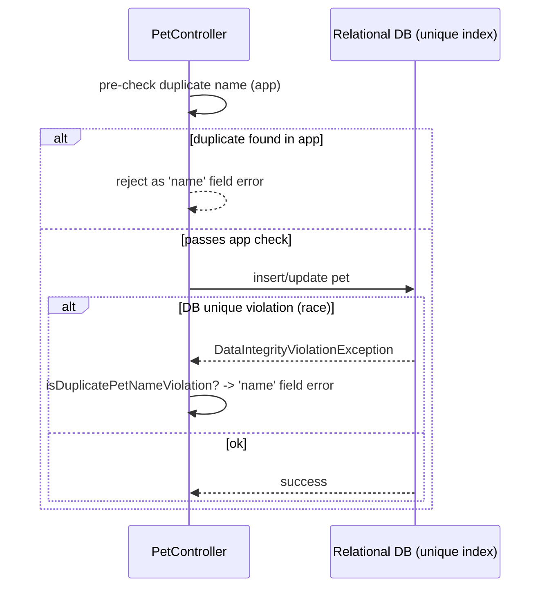

# Pattern: Layered Uniqueness Enforcement

## Status
Candidate — no explicit approval metadata or ADR exists in the repository to promote this pattern.

## Category
data

## Problem
A business uniqueness rule (e.g. no two pets with the same name under one owner) must hold reliably even
under concurrency, while still giving the user a friendly, field-level error rather than a raw failure.

## Context
`petclinic` enforces the "unique pet name per owner" rule at **two layers**: the application pre-checks for
a duplicate name before saving, and the **database** enforces a unique constraint/index
(`unique_owner_pet_name` on `(owner_id, LOWER(name))` in PostgreSQL; `UNIQUE(owner_id, name)` in H2). When
a concurrent insert slips past the app check, the DB rejects it and the controller catches the resulting
`DataIntegrityViolationException`, re-checks whether it is the duplicate-name violation, and surfaces it as
a `name` field error on the form instead of a 500.

## When to Use
- A uniqueness/consistency rule must hold even under concurrent writes.
- You want a friendly field-level error for the common case but a guaranteed backstop for the race.
- The rule can be expressed as a database constraint.

## When Not to Use
- The rule cannot be expressed as a DB constraint (then application/transaction logic must carry it fully).
- Uniqueness spans systems/aggregates where a single DB constraint cannot reach (needs a different strategy).

## Architecture Summary
`app pre-check (friendly path) + DB unique constraint (authoritative backstop) + exception translation
(DataIntegrityViolationException → field error)`. The DB is the source of truth; the app check optimizes UX.

## Structure / Flow

## Key Components
- **Application pre-check** — duplicate-name check in `owner/PetController.java`.
- **Exception translation** — catch `DataIntegrityViolationException`, `isDuplicatePetNameViolation(...)`,
  re-surface as a `name` field error.
- **Database constraint** — `unique_owner_pet_name` in `db/postgres/schema.sql` (functional, `LOWER(name)`);
  `UNIQUE(owner_id, name)` in `db/h2/schema.sql`.

## Data / Event / API Contracts
- The uniqueness invariant is part of the schema contract (see
  [Script-Based Relational Schema Provisioning](script-based-schema-provisioning.md)).
- At the HTTP layer the violation appears as a form field error (no distinct API error body for these view endpoints).

## Naming Conventions
- The DB constraint is explicitly named (`unique_owner_pet_name`) for diagnosability.
- The translation helper is named for the specific violation (`isDuplicatePetNameViolation`).

## Service / Boundary Guidance
- Treat the database constraint as the authoritative enforcement point; the application check is a UX
  optimization, not the guarantee.
- Keep the exception-to-field-error translation in the controller so the user sees a coherent form error.
- Note the engine-specific difference (case-insensitive functional index on PostgreSQL vs plain unique on
  H2) — reconcile both when changing the rule.

## Security / Compliance Considerations
- Enforcing the invariant in the DB prevents application-logic bypass from creating inconsistent data.
- No sensitive data is involved; this is a data-integrity control, not access control.

## Observability Considerations
- Database constraint violations are visible in DB/application logs; a spike can indicate a race or a
  weakened application pre-check.
- The named constraint aids root-cause analysis when the violation surfaces.

## Failure Handling
- Common case: app pre-check rejects the duplicate with a friendly field error, no DB round-trip needed.
- Race case: DB rejects, controller translates the exception to the same field error (no 500).
- Unrelated integrity violations are not swallowed — only the recognized duplicate-name case is translated.

## Trade-offs
- **Gains:** guaranteed integrity under concurrency (DB), friendly UX for the common case (app), no 500 on the race.
- **Costs:** the rule is expressed in two places (app + per-engine DDL) and must be kept consistent; engine
  differences add care; the app pre-check is redundant work in the happy path.

## Variants
- **DB-only enforcement** with exception translation only (drop the app pre-check) — simpler, slightly worse UX.
- **App/transaction-only enforcement** where a DB constraint is not possible — weaker under concurrency.

## Anti-patterns
- Relying solely on an application check (a race can still create duplicates).
- Catching `DataIntegrityViolationException` broadly and treating every violation as the duplicate-name case.
- Changing the rule in one engine's schema but not the others.

## Evidence
- **ADR:** None — no ADRs exist in the repository.
- **Repo:** `spring-petclinic`.
- **Service:** `petclinic`.
- **File:** `owner/PetController.java` (pre-check, `DataIntegrityViolationException` catch,
  `isDuplicatePetNameViolation`); `db/postgres/schema.sql` (`unique_owner_pet_name` on `(owner_id, LOWER(name))`);
  `db/h2/schema.sql` (`UNIQUE(owner_id, name)`).
- **API/Event:** add/edit pet endpoints (`docs/architecture-inventory/baselines/api-inventory.md` E11/E13); no events.
- **Deployment/Config:** constraint provisioned via the schema init scripts.
- **Notes:** Catalogued as an invariant in capability-baseline §8 (C2).

## Related ADRs
None. No ADRs exist in the `spring-petclinic` repository.

## Related Patterns
- [Script-Based Relational Schema Provisioning](script-based-schema-provisioning.md)
- [Post-Redirect-Get Form Handling with Bean Validation](../ui/post-redirect-get-form-validation.md)
- [Aggregate-Root Persistence via Spring Data JPA](aggregate-root-persistence.md)

## Recommendation
Enforce uniqueness/consistency invariants in the database (authoritative) and translate the resulting
integrity exception into a friendly field error, keeping an optional application pre-check for the common
case. Always mirror the constraint across supported engines and scope the exception translation to the
specific, recognized violation.

## Assumptions, Blockers & Open Questions

> [!IMPORTANT]
> This document contains unresolved items that require attention before or during implementation. Review and resolve before merging downstream artifacts.

### Assumptions
| # | Assumption | Rationale | Impact if Wrong | Validation Path |
|---|------------|-----------|-----------------|-----------------|
| A1 | The PostgreSQL functional unique index and the H2 plain unique enforce equivalent semantics for the deployed engine. | Both are present in their engine's `schema.sql`; PostgreSQL uses `LOWER(name)` (case-insensitive), H2 uses `UNIQUE(owner_id, name)`. | Case-sensitivity differences between engines could allow a duplicate in one environment that another rejects. | Confirm the deployed engine and align case semantics across engine scripts. |

### Open Questions
| # | Question | Why It Matters | Proposed Answer (if any) | Decision Owner |
|---|----------|----------------|--------------------------|----------------|
| Q1 | Should the H2 constraint be made case-insensitive to match PostgreSQL? | Divergent case semantics create environment-specific behaviour for duplicate detection. | Align H2 to case-insensitive to match production PostgreSQL. | Platform / data owner |
