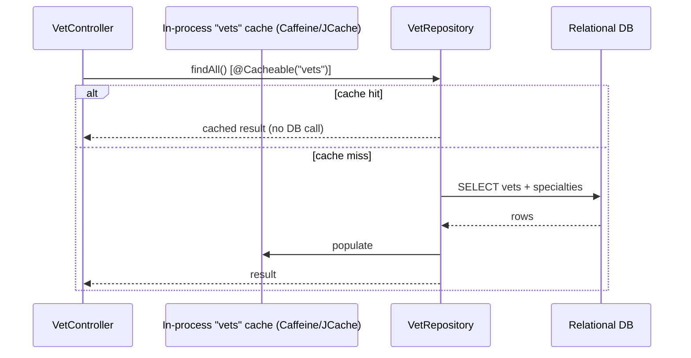

# Pattern: Read-Through In-Process Cache for Read-Mostly Data

## Status
Candidate — no explicit approval metadata or ADR exists in the repository to promote this pattern.

## Category
data

## Problem
A read-mostly dataset is queried far more often than it changes, and repeatedly hitting the database for
identical results wastes work and latency.

## Context
The veterinarian directory in `petclinic` is read-heavy and rarely mutated (there is no write path for
vets in the app). Its repository reads are wrapped with a declarative `@Cacheable("vets")` annotation, so
results are served from an **in-process** JCache/Caffeine cache after the first load. The cache is created
and configured in `system/CacheConfiguration` with JMX statistics enabled. It is a **local** cache — there
is no Redis/Memcached or any networked cache in the repository.

## When to Use
- The data is read-mostly and tolerant of a short staleness window.
- Query results are identical across many requests (a good cache-key hit rate).
- A single-process/local cache is acceptable (no cross-node coherence requirement, or eventual consistency is fine).

## When Not to Use
- Data changes frequently or must be strongly consistent immediately after writes.
- Multiple nodes must share a coherent cache (in-process caches diverge per instance).
- The cached object graph is large enough to pressure heap.

## Architecture Summary
Repository read method annotated `@Cacheable(<name>)` → first call loads from DB and populates the cache
→ subsequent calls return the cached value from the JVM heap. Cache creation/config is centralized in a
`@EnableCaching` configuration bean.

## Structure / Flow

## Key Components
- **Cached repository reads** — `vet/VetRepository.java` (`@Cacheable("vets")` on the `findAll` overloads).
- **Cache configuration** — `system/CacheConfiguration.java` (`@EnableCaching`, creates the `vets` cache
  via `JCacheManagerCustomizer`, `setStatisticsEnabled(true)`).
- **Consumer** — `vet/VetController.java` (both the HTML list and the JSON data endpoint).

## Data / Event / API Contracts
- No external cache contract; the cache is an implementation detail behind the repository.
- The cached payload corresponds to the vet/specialty object graph served by the vet endpoints (see API inventory E16/E17).

## Naming Conventions
- Cache names are the domain noun of the cached collection (`vets`).
- Caching is declared at the repository read method with `@Cacheable(<cacheName>)`.
- Cache creation is centralized in a single `CacheConfiguration` rather than scattered.

## Service / Boundary Guidance
- Keep the cache local to the read-mostly module (`vet`); do not cache write-heavy or per-user data with a
  shared, unkeyed cache.
- Centralize cache declarations/config in `system/CacheConfiguration` so caches are discoverable.
- If a write path is added for the cached entity, add explicit eviction (`@CacheEvict`) on that path.

## Security / Compliance Considerations
- The cache holds only non-sensitive directory data (vets/specialties); no personal or regulated data is cached in-repo.
- In-process caching means no data leaves the JVM — no external cache trust boundary to secure.

## Observability Considerations
- **JCache statistics are enabled and exposed via JMX**, giving hit/miss visibility.
- Size limits and TTL are **not** configured in-repo — eviction relies on provider defaults; this is a gap
  (see ABQ) worth wiring to metrics if the dataset grows.

## Failure Handling
- On a cache miss the read falls through to the database transparently (read-through).
- There is no explicit eviction path because there is no in-app write path for vets; stale reads persist
  until the cache entry is evicted by provider policy or process restart.

## Trade-offs
- **Gains:** fewer DB round-trips for identical reads, lower latency, declarative and unobtrusive.
- **Costs:** potential staleness; per-node cache divergence in a multi-instance deployment; unbounded size
  if limits are unset; no cross-node coherence.

## Variants
- **Distributed cache** (Redis/Memcached) for cross-node coherence — not present here; would be a new pattern/decision.
- **Explicit TTL + size-bounded local cache** — configure Caffeine limits and expiry for predictable eviction.
- **Cache-aside** where the caller manages population/eviction, instead of declarative read-through.

## Anti-patterns
- Caching frequently-mutated data without an eviction strategy (stale reads).
- Assuming an in-process cache is coherent across replicas.
- Leaving size/TTL unbounded on a growing dataset.

## Evidence
- **ADR:** None — no ADRs exist in the repository.
- **Repo:** `spring-petclinic`.
- **Service:** `petclinic`.
- **File:** `vet/VetRepository.java:45,55` (`@Cacheable("vets")`); `system/CacheConfiguration.java`
  (`@EnableCaching`, `createCache("vets", ...)`, `setStatisticsEnabled(true)`); `vet/VetController.java`.
- **API/Event:** `GET /vets.html`, `GET /vets` (`docs/architecture-inventory/baselines/api-inventory.md` E16/E17); no events.
- **Deployment/Config:** `pom.xml` Caffeine/JCache dependencies; JMX statistics enabled.
- **Notes:** Confirmed local cache only — no Redis/Memcached dependency anywhere (architecture-baseline §3).

## Related ADRs
None. No ADRs exist in the `spring-petclinic` repository.

## Related Patterns
- [Aggregate-Root Persistence via Spring Data JPA](aggregate-root-persistence.md)
- [Health Probe & Management-Endpoint Exposure](../observability/health-probe-and-management-endpoints.md)

## Recommendation
Use declarative read-through caching for read-mostly, low-churn datasets, keeping cache config centralized
and statistics enabled. Before relying on it under load, set explicit size/TTL limits and add eviction on
any future write path. For multi-node coherence requirements, evaluate a distributed cache as a separate
decision.

## Assumptions, Blockers & Open Questions

> [!IMPORTANT]
> This document contains unresolved items that require attention before or during implementation. Review and resolve before merging downstream artifacts.

### Assumptions
| # | Assumption | Rationale | Impact if Wrong | Validation Path |
|---|------------|-----------|-----------------|-----------------|
| A1 | The `vets` data is read-mostly with no in-app write path, so no eviction is needed today. | No vet create/update controller exists in the source tree. | If a vet write path is added without eviction, stale directory reads would result. | Add `@CacheEvict` when a vet write path is introduced; confirm data-change frequency with the domain owner. |

### Open Questions
| # | Question | Why It Matters | Proposed Answer (if any) | Decision Owner |
|---|----------|----------------|--------------------------|----------------|
| Q1 | What size limit / TTL should the `vets` cache use? | Defaults leave eviction unbounded; matters as the dataset grows or under memory pressure. | Configure Caffeine size/expiry explicitly. | Platform / data owner |
| Q2 | Is the platform ever deployed multi-instance, requiring cache coherence? | In-process caches diverge per replica; a distributed cache may be needed. | Single-instance today (one `Deployment`); no evidence of scale-out. | Platform / DevOps owner |
