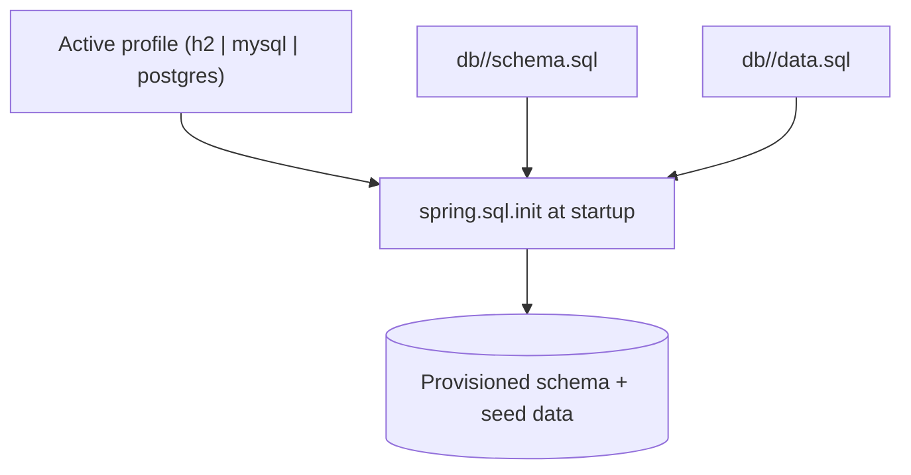

# Pattern: Script-Based Relational Schema Provisioning

## Status
Candidate — no explicit approval metadata or ADR exists in the repository to promote this pattern.

## Category
data

## Problem
The database schema and seed data must be created deterministically at startup, without letting the ORM
silently mutate the schema at runtime, and while supporting multiple database engines.

## Context
`petclinic` disables runtime DDL generation (`spring.jpa.hibernate.ddl-auto=none`) and instead applies
checked-in SQL via `spring.sql.init`: per-engine `db/{h2,mysql,postgres}/schema.sql` and `data.sql`. The
schema is authored by hand, one variant per engine, and seed data is loaded on startup. There is **no**
migration tool (Flyway/Liquibase) in the repository, so the three engine variants are maintained manually
and can drift.

## When to Use
- You want explicit, reviewable schema/seed as source-controlled SQL applied at startup.
- The ORM must never auto-alter production schema (`ddl-auto=none`).
- The schema is small/stable enough that hand-maintained per-engine scripts are manageable.
- You support multiple database engines with engine-specific DDL.

## When Not to Use
- The schema evolves frequently and needs versioned, ordered, repeatable migrations across environments.
- Multiple engines must stay in lockstep and manual drift is unacceptable — a migration tool is warranted.
- Zero-downtime, incremental schema changes are required.

## Architecture Summary
`ddl-auto=none` (no runtime DDL) + `spring.sql.init` applying per-engine `schema.sql` then `data.sql` at
startup. Engine selection is driven by the active profile (see
[Profile-Based Environment & Datastore Selection](../deployment/profile-based-environment-configuration.md)).

## Structure / Flow

## Key Components
- **Runtime DDL disabled** — `application.properties` `spring.jpa.hibernate.ddl-auto=none`.
- **Init execution** — `spring.sql.init` picking scripts by engine.
- **Per-engine scripts** — `src/main/resources/db/{h2,mysql,postgres}/schema.sql` and `data.sql`.
- **DB-enforced invariant** — the unique pet-name index lives in `schema.sql` (see
  [Layered Uniqueness Enforcement](layered-uniqueness-enforcement.md)).

## Data / Event / API Contracts
- The "contract" is the schema DDL itself (tables `owners, pets, types, visits, vets, specialties,
  vet_specialties`) and the seed data, versioned in source.
- No API/event contract.

## Naming Conventions
- Scripts grouped by engine under `db/<engine>/` with fixed names `schema.sql` and `data.sql`.
- Tables and constraints named for domain nouns; the unique constraint is named (`unique_owner_pet_name`).

## Service / Boundary Guidance
- The schema is owned by the single deployable; intra-schema foreign keys are intra-service relations, not
  cross-service coupling.
- Keep engine-specific DDL differences (e.g. functional unique index on PostgreSQL vs plain unique on H2)
  isolated in their engine's script and explicitly reconciled.

## Security / Compliance Considerations
- Schema and seed are reviewable in source control (change auditability).
- Seed `data.sql` should contain only non-sensitive sample data — no secrets in scripts (credentials are
  injected via config, per the deployment pattern).

## Observability Considerations
- Startup init success/failure is visible in application logs; a failed script fails startup (fail-fast).
- There is no migration-history table (no Flyway/Liquibase), so "what version is deployed" is not queryable
  at runtime — a traceability gap.

## Failure Handling
- A malformed or failing init script aborts application startup, preventing a half-provisioned schema.
- Because there is no migration ordering/versioning, re-applying scripts against an already-provisioned DB
  must be handled carefully (idempotency is the script author's responsibility).

## Trade-offs
- **Gains:** explicit reviewable schema, no surprise runtime DDL, multi-engine support, simple mental model.
- **Costs:** three hand-maintained variants can drift; no versioned/ordered migrations; no deployed-version
  visibility; not suited to frequent incremental change.

## Variants
- **Versioned migrations** (Flyway/Liquibase) — ordered, repeatable, with a history table (not present here;
  would be a pattern-update proposal if adopted).
- **Single-engine schema** if multi-engine support is dropped, removing drift risk.

## Anti-patterns
- Leaving `ddl-auto` on `update`/`create` in production (silent schema mutation).
- Editing one engine's `schema.sql` without mirroring the change to the others.
- Putting sensitive data in `data.sql`.

## Evidence
- **ADR:** None — no ADRs exist in the repository.
- **Repo:** `spring-petclinic`.
- **Service:** `petclinic`.
- **File:** `application.properties` (`spring.jpa.hibernate.ddl-auto=none`, `spring.sql.init`);
  `src/main/resources/db/{h2,mysql,postgres}/schema.sql` + `data.sql`.
- **API/Event:** n/a.
- **Deployment/Config:** engine chosen by active profile (see deployment pattern).
- **Notes:** No Flyway/Liquibase dependency anywhere; drift risk noted in architecture-baseline §3 and capability-baseline §6.

## Related ADRs
None. No ADRs exist in the `spring-petclinic` repository.

## Related Patterns
- [Profile-Based Environment & Datastore Selection](../deployment/profile-based-environment-configuration.md)
- [Layered Uniqueness Enforcement](layered-uniqueness-enforcement.md)
- [Aggregate-Root Persistence via Spring Data JPA](aggregate-root-persistence.md)

## Recommendation
Keep `ddl-auto=none` with source-controlled init scripts for small, stable schemas. If schema change
frequency grows or engine drift becomes a real risk, adopt a versioned migration tool (Flyway/Liquibase)
as an explicit decision (ADR) and pattern-update proposal, and add a deployed-version history table.

## Assumptions, Blockers & Open Questions

> [!IMPORTANT]
> This document contains unresolved items that require attention before or during implementation. Review and resolve before merging downstream artifacts.

### Assumptions
| # | Assumption | Rationale | Impact if Wrong | Validation Path |
|---|------------|-----------|-----------------|-----------------|
| A1 | Hand-maintained per-engine scripts are kept in sync manually (no migration tool). | No Flyway/Liquibase dependency exists; three `schema.sql` variants are present. | Undetected drift between engines could cause environment-specific defects. | Add a cross-engine schema diff check, or adopt a migration tool. |

### Open Questions
| # | Question | Why It Matters | Proposed Answer (if any) | Decision Owner |
|---|----------|----------------|--------------------------|----------------|
| Q1 | Should the platform adopt versioned migrations (Flyway/Liquibase)? | Removes manual drift risk and adds deployed-version traceability as schema change frequency grows. | None present today; adopt if change frequency increases. | Platform / data owner |
