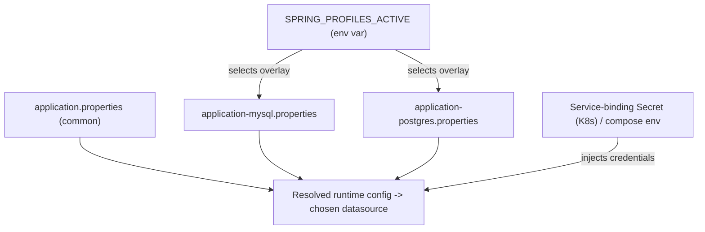

# Pattern: Profile-Based Environment & Datastore Selection

## Status
Candidate — no explicit approval metadata or ADR exists in the repository to promote this pattern.

## Category
deployment

## Problem
One build artifact must run in different environments and against different datastores without rebuilding
or forking configuration, while keeping environment-specific settings out of code.

## Context
`petclinic` ships one artifact that runs on **H2** (default, in-memory), **MySQL**, or **PostgreSQL**. A
base `application.properties` holds common config; per-engine `application-mysql.properties` /
`application-postgres.properties` hold engine-specific settings; the active engine is chosen by the
**Spring profile** activated at runtime. The Kubernetes deployment sets `SPRING_PROFILES_ACTIVE=postgres`;
local `docker-compose` provisions MySQL and PostgreSQL for developers to select between. DB credentials
are supplied via environment/profile config and (in Kubernetes) a service-binding Secret — not hard-coded.

## When to Use
- The same artifact must target multiple environments/datastores selected at deploy time.
- You want a base configuration plus environment overlays instead of forked config.
- Secrets/credentials should be injected per environment rather than baked into the image.

## When Not to Use
- Only one fixed environment/datastore ever exists (profiles add indirection for no benefit).
- Environment differences are so large that a single artifact cannot sanely serve them.

## Architecture Summary
`base config + profile overlay (activated by an env var) → resolved runtime config`. The active profile
selects the datasource and engine-specific settings; credentials/binding are injected by the platform.

## Structure / Flow

## Key Components
- **Base + overlay config** — `application.properties`, `application-mysql.properties`, `application-postgres.properties`.
- **Profile activation** — `SPRING_PROFILES_ACTIVE` (set to `postgres` in `k8s/petclinic.yml`).
- **Credential injection** — Kubernetes `servicebinding.io/postgresql` Secret; `docker-compose.yml` env for local.

## Data / Event / API Contracts
- No API/event contract; this is a configuration/deployment pattern.
- The "contract" is the set of expected property keys per profile and the injected credential shape.

## Naming Conventions
- Overlay files named `application-<profile>.properties`.
- Profile names match the engine (`mysql`, `postgres`); `h2` is the default (no profile).
- Activation via the standard `SPRING_PROFILES_ACTIVE` environment variable.

## Service / Boundary Guidance
- Keep common settings in the base file and only engine/environment-specific settings in overlays.
- Never commit real credentials; inject them per environment (Secret / env), as this repo does.
- The active profile is a deploy-time decision owned by the deployment manifest, not the code.

## Security / Compliance Considerations
- Credentials are externalized (env/profile + K8s Secret), avoiding secrets in the image/source.
- Note the default profile also enables the H2 console and full Actuator exposure — those are flagged
  dev/test-only by inline comments; production restriction is unverified in-repo (see the observability
  pattern and ABQ).

## Observability Considerations
- The active profile determines which datastore health/readiness reflects; probes should target the
  active engine (see [Health Probe & Management-Endpoint Exposure](../observability/health-probe-and-management-endpoints.md)).
- Log the active profile at startup to make environment resolution auditable.

## Failure Handling
- A missing/misnamed profile falls back to the default (H2), which can silently run the wrong datastore —
  make the active profile explicit and asserted.
- Missing injected credentials fail datasource initialization at startup (fail-fast).

## Trade-offs
- **Gains:** one artifact across environments, clean separation of common vs environment config, secrets
  injected not baked, easy local/prod parity.
- **Costs:** profile sprawl if overlays multiply; silent wrong-default risk; per-engine schema variants must
  be kept in sync (see [Script-Based Relational Schema Provisioning](../data/script-based-schema-provisioning.md)).

## Variants
- **Externalized config server** (centralized config) instead of packaged overlay files.
- **Per-environment values files** (Helm/Kustomize) layered over the same artifact.

## Anti-patterns
- Hard-coding credentials or environment specifics in the base config or image.
- Relying on the default profile in production instead of explicitly activating one.
- Letting engine overlays diverge in ways the schema scripts don't reflect.

## Evidence
- **ADR:** None — no ADRs exist in the repository.
- **Repo:** `spring-petclinic`.
- **Service:** `petclinic`.
- **File:** `src/main/resources/application.properties`, `application-mysql.properties`, `application-postgres.properties`.
- **API/Event:** n/a.
- **Deployment/Config:** `k8s/petclinic.yml` (`SPRING_PROFILES_ACTIVE=postgres`), `k8s/db.yml`
  (`servicebinding.io/postgresql` Secret), `docker-compose.yml` (mysql/postgres containers).
- **Notes:** Default runtime is in-memory H2 unless a profile overrides (architecture-baseline §6, A2).

## Related ADRs
None. No ADRs exist in the `spring-petclinic` repository.

## Related Patterns
- [Script-Based Relational Schema Provisioning](../data/script-based-schema-provisioning.md)
- [Health Probe & Management-Endpoint Exposure](../observability/health-probe-and-management-endpoints.md)

## Recommendation
Use base-plus-overlay profile configuration for multi-environment/multi-datastore artifacts, always
activate the intended profile explicitly (never depend on the default in production), and inject
credentials per environment. Log the resolved profile at startup for auditability.

## Assumptions, Blockers & Open Questions

> [!IMPORTANT]
> This document contains unresolved items that require attention before or during implementation. Review and resolve before merging downstream artifacts.

### Assumptions
| # | Assumption | Rationale | Impact if Wrong | Validation Path |
|---|------------|-----------|-----------------|-----------------|
| A1 | Production runs the `postgres` profile as declared in the K8s manifest. | `k8s/petclinic.yml` sets `SPRING_PROFILES_ACTIVE=postgres`. | Runtime/persistence reasoning could target the wrong engine (e.g. engine-specific schema features). | Confirm `SPRING_PROFILES_ACTIVE` per environment with DevOps. |

### Open Questions
| # | Question | Why It Matters | Proposed Answer (if any) | Decision Owner |
|---|----------|----------------|--------------------------|----------------|
| Q1 | Are the H2 console and full Actuator exposure disabled in the production profile? | The default/base config enables both, flagged dev-only; production posture is unverified. | Assumed dev-only per inline comments; verify production overrides. | Security / platform owner |
