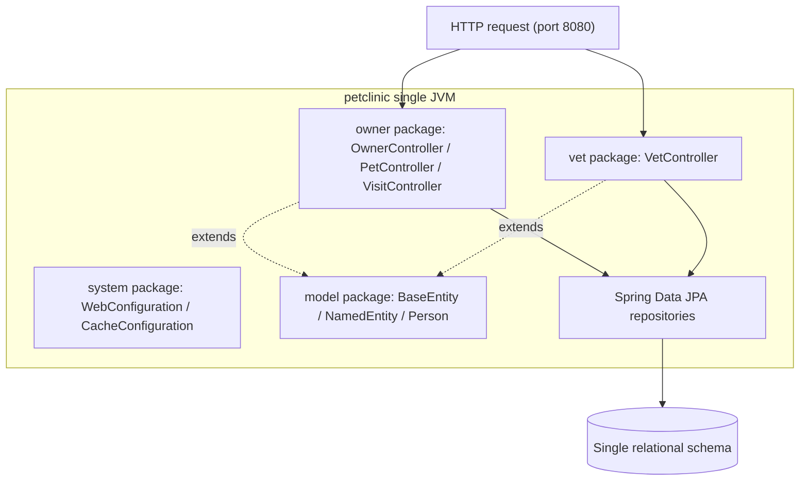

# Pattern: Layered Monolith with Package-Scoped Modules

## Status
Candidate — no explicit approval metadata or ADR exists in the repository to promote this pattern.

## Category
domain

## Problem
A cohesive business domain needs clear internal module boundaries and a simple, layered request flow
without paying the operational cost (network hops, distributed transactions, service discovery) of a
distributed architecture.

## Context
The `petclinic` platform is a single deployable — one Spring Boot process, one JVM, one relational
schema — serving a veterinary-clinic domain (owners, pets, visits, vets/specialties). Internal
responsibilities are organised by Java **package** as logical modules, not as separately deployable
units. Each request follows one synchronous layered path inside the process: HTTP controller → Spring
Data JPA repository → shared relational schema. There is no message broker, event bus, API gateway, or
second process anywhere in the tree.

## When to Use
- The domain is small-to-medium and fits comfortably in one deployable and one schema.
- Team size and operational maturity favour a single build/deploy unit over a service fleet.
- Strong internal modularity (by feature package) is enough; independent scaling per feature is not required.
- You want the simplest possible request path and transactional model (single datasource).

## When Not to Use
- Distinct features need independent deployment cadence, scaling, or failure isolation.
- Multiple teams must own and release parts of the system independently.
- The domain requires polyglot persistence or per-feature datastores.
- Regulatory/tenancy isolation demands separate runtime boundaries.

## Architecture Summary
Responsibilities are split into feature packages (`owner`, `vet`), a shared domain-base package
(`model`), and a cross-cutting platform package (`system`). Each feature package contains its
controllers, entities, and repositories; all coordinate by in-process method calls. The presentation
layer (template views + MVC controllers) sits above a domain/persistence layer (JPA entities +
repositories) over one relational schema.

## Structure / Flow

## Key Components
- **Feature packages** — `owner` (C1–C3), `vet` (C4): controllers + entities + repositories per feature.
- **Shared domain base** — `model` package (`BaseEntity`, `NamedEntity`, `Person`) reused by feature entities via inheritance.
- **Platform / cross-cutting** — `system` package (`WelcomeController`, `WebConfiguration`, `CacheConfiguration`, `CrashController`).
- **Persistence layer** — Spring Data JPA repositories over one schema.

## Data / Event / API Contracts
- No inter-module network contracts exist — modules coordinate by direct method calls.
- Cross-module coupling is through the **shared schema** (foreign keys within one owned database) and the
  shared `model` superclasses, not through APIs or events.
- The external surface is HTTP (see the API inventory); there are no async event contracts.

## Naming Conventions
- One package per feature under `org.springframework.samples.petclinic.<feature>`.
- Controllers `<Feature>Controller`; entities named for the domain noun; repositories `<Entity>Repository`.
- Cross-cutting configuration lives in the `system` package; shared base types in `model`.

## Service / Boundary Guidance
- The deployable boundary is the `petclinic` process; module boundaries are **package** boundaries, not
  service boundaries.
- Keep a feature's controller, entity, and repository in its package; put genuinely shared base types in
  `model` and application-wide config in `system`.
- Treat the single schema as a shared resource: intra-schema foreign keys are intra-service relations,
  not cross-service coupling — do not model them as service dependencies.

## Security / Compliance Considerations
- A single process means one trust boundary; there is no per-module network authz to enforce.
- The repository declares no application authentication/authorization (no Spring Security). Any access
  control for the whole deployable must be added at the app or edge layer — see the security pattern
  [Data-Binding Field Allowlist](../security/data-binding-field-allowlist.md) for the input-side controls
  that do exist.

## Observability Considerations
- One process yields one set of logs/metrics; there is no distributed trace to correlate.
- Management/health surfaces are provided at the deployable level — see
  [Health Probe & Management-Endpoint Exposure](../observability/health-probe-and-management-endpoints.md).

## Failure Handling
- Failures propagate as in-process exceptions within a single request thread; there is no partial-failure
  or cross-service retry concern.
- Unmapped domain exceptions surface as HTTP 500 via the framework default error path (no
  `@ControllerAdvice` present) — a gap noted in the API inventory.

## Trade-offs
- **Gains:** simplest deploy/build unit, single-datasource transactions, no network failure modes, fast
  local reasoning.
- **Costs:** no independent scaling/deploy per feature; the shared schema is a coupling surface; module
  boundaries are only as strong as team discipline (a package import can bypass intended boundaries).

## Variants
- **Modular monolith with enforced module boundaries** (e.g. build-time module verification) — stronger
  isolation than package convention alone.
- **Aggregate-oriented packaging** — the `owner` package already groups C1–C3 around the owner aggregate
  (see [Aggregate-Root Persistence](../data/aggregate-root-persistence.md)).

## Anti-patterns
- Reaching across packages into another feature's repository/internals instead of going through its
  intended entry points.
- Treating intra-schema foreign keys as if they were cross-service contracts.
- Growing a "god" package that accumulates unrelated features until boundaries dissolve.

## Evidence
- **ADR:** None — no ADRs exist in the repository (architecture-baseline §7).
- **Repo:** `spring-petclinic`.
- **Service:** `petclinic` (single deployable; K8s/Maven name `petclinic`).
- **File:** `src/main/java/org/springframework/samples/petclinic/{owner,vet,model,system}/**`;
  `PetClinicApplication.java`.
- **API/Event:** HTTP-only surface (`docs/architecture-inventory/baselines/api-inventory.md`); no events.
- **Deployment/Config:** `k8s/petclinic.yml` (one `Deployment`/`Service`); `pom.xml` `<name>petclinic</name>`.
- **Notes:** Confirmed absence of any second process, broker, or gateway across source, dependencies, and manifests.

## Related ADRs
None. No ADRs exist in the `spring-petclinic` repository.

## Related Patterns
- [Aggregate-Root Persistence via Spring Data JPA](../data/aggregate-root-persistence.md)
- [Server-Rendered MVC with Template Views](../ui/server-rendered-mvc-views.md)
- [Script-Based Relational Schema Provisioning](../data/script-based-schema-provisioning.md)

## Recommendation
Continue using the package-scoped layered monolith while the domain fits one deployable and one schema.
If independent deployability, per-feature scaling, or tenant isolation becomes a requirement, treat that
as a decision worthy of an ADR and re-evaluate against a service-decomposition pattern (which would be a
pattern-update proposal, not a current-state entry).

## Assumptions, Blockers & Open Questions

> [!IMPORTANT]
> This document contains unresolved items that require attention before or during implementation. Review and resolve before merging downstream artifacts.

### Assumptions
| # | Assumption | Rationale | Impact if Wrong | Validation Path |
|---|------------|-----------|-----------------|-----------------|
| A1 | Package boundaries are the intended module boundaries. | Feature code is consistently grouped by package with no cross-package repository access observed. | If a different modularization is intended, boundary guidance here would mislead future work. | Confirm module strategy with the platform architecture owner. |

### Open Questions
| # | Question | Why It Matters | Proposed Answer (if any) | Decision Owner |
|---|----------|----------------|--------------------------|----------------|
| Q1 | Is single-deployable modularity expected to hold, or is service decomposition planned? | Determines whether to invest in enforced module boundaries or plan a split. | Single deployable today; no split evidenced in-repo. | Product / architecture owner |
