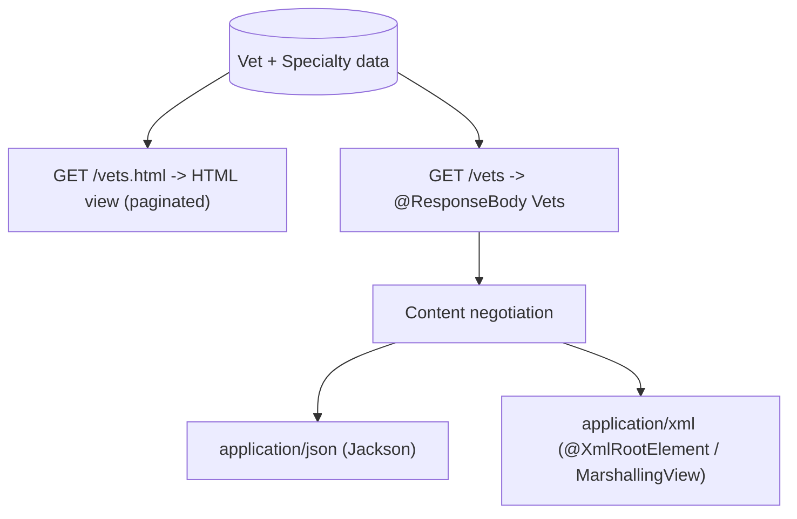

# Pattern: Content-Negotiated Dual Representation

## Status
Candidate — no explicit approval metadata or ADR exists in the repository to promote this pattern.

## Category
integration

## Problem
The same domain data must serve both a human-facing web page and a machine-readable resource, without
duplicating the query/logic or maintaining two divergent data paths.

## Context
The veterinarian directory in `petclinic` is exposed two ways over the same underlying data: `GET
/vets.html` returns a paginated **HTML view**, and `GET /vets` (`@ResponseBody`) returns the full list as
a **serialized `Vets` object graph**, negotiated to JSON (Jackson) or XML (`@XmlRootElement` via a
marshalling view) by content negotiation. A dedicated representation class (`Vets` wrapping `Vet`) is used
for the machine representation so serialization is stable and decoupled from rendering. This is the
platform's only machine-facing API surface.

## When to Use
- The same data must be consumed by both browsers (HTML) and programmatic clients (JSON/XML).
- You want one server-side source of truth for the data with representation chosen by the request.
- A stable serialization shape is worth a small dedicated representation/DTO class.

## When Not to Use
- Only one consumer type exists (pure UI or pure API).
- The machine and human representations need materially different data/shaping (then separate endpoints/DTOs are clearer).

## Architecture Summary
Two endpoints over one dataset: a view endpoint returns a template view name; a data endpoint returns a
`@ResponseBody` representation object that the framework serializes by content negotiation (JSON/XML). A
wrapper class provides a stable, mapping-friendly shape.

## Structure / Flow

## Key Components
- **View endpoint** — `vet/VetController.showVetList` → `vets/vetList` (paginated HTML).
- **Data endpoint** — `vet/VetController.showResourcesVetList` → `@ResponseBody Vets`.
- **Representation class** — `vet/Vets.java` wrapping `vet/Vet.java` (with `@XmlRootElement`/JAXB + Jackson serialization).

## Data / Event / API Contracts
- Machine contract (observed, reconstructed from the class graph):
  `{ "vetList": [ { "id", "firstName", "lastName", "specialties": [ { "id", "name" } ], "nrOfSpecialties" } ] }`.
- Serialized as JSON or XML by content negotiation; HTTP 200 (see API inventory E17).
- HTML endpoint has no machine contract (it returns a view).

## Naming Conventions
- View endpoint uses a `.html` suffix (`/vets.html`); data endpoint uses the bare resource path (`/vets`).
- The machine representation is a dedicated wrapper class named for the plural collection (`Vets`).

## Service / Boundary Guidance
- Keep the machine representation in a dedicated class (not the raw entity) so the wire contract is stable
  and independent of persistence changes.
- Read paths may share a cache (see [Read-Through In-Process Cache](../data/read-through-in-process-cache.md)),
  keeping both representations consistent from one source.

## Security / Compliance Considerations
- The data endpoint is unauthenticated in-repo (no Spring Security); a machine API generally needs an auth
  decision at the app or edge — flagged as a gap in the API inventory.
- Expose only intended fields in the representation class to avoid leaking internal entity state.

## Observability Considerations
- The data endpoint is a versionable/measurable contract; add request metrics if external consumers appear.
- Consumers of `GET /vets` are unknown in-repo (no in-repo client) — a traceability gap (API inventory G1).

## Failure Handling
- No custom error handler exists; JSON clients receive the framework default error body
  (`{timestamp,status,error,path}`); HTML clients receive the default `error` view.
- Consider a dedicated error contract if the data endpoint gains real external consumers.

## Trade-offs
- **Gains:** one data source serves two consumer types; stable serialization via a dedicated class; content
  negotiation picks the format automatically.
- **Costs:** two endpoints to keep aligned; the representation class is extra code; without versioning,
  contract evolution risks breaking machine consumers.

## Variants
- **Single endpoint, format by `Accept`** — one path negotiating HTML vs JSON (rather than two paths).
- **Versioned API** (`/v1/...`) with an explicit spec (OpenAPI) if external consumers need compatibility guarantees.

## Anti-patterns
- Serializing raw JPA entities directly (leaks internal fields, couples wire shape to schema).
- Divergent data between the HTML and machine representations.
- Publishing a machine endpoint with no auth decision when it carries sensitive data.

## Evidence
- **ADR:** None — no ADRs exist in the repository.
- **Repo:** `spring-petclinic`.
- **Service:** `petclinic`.
- **File:** `vet/VetController.java` (`/vets.html` view + `/vets` `@ResponseBody`), `vet/Vets.java`,
  `vet/Vet.java`, `vet/Specialty.java`.
- **API/Event:** `docs/architecture-inventory/baselines/api-inventory.md` E16 (view) and E17 (data endpoint); no events.
- **Deployment/Config:** JSON via Jackson; XML via `@XmlRootElement`/`MarshallingView` (content negotiation).
- **Notes:** This is the platform's only machine-facing API surface (architecture-baseline §3).

## Related ADRs
None. No ADRs exist in the `spring-petclinic` repository.

## Related Patterns
- [Server-Rendered MVC with Template Views](../ui/server-rendered-mvc-views.md)
- [Read-Through In-Process Cache for Read-Mostly Data](../data/read-through-in-process-cache.md)

## Recommendation
Use a dedicated representation class and content negotiation when one dataset must serve both HTML and
machine clients. If the machine endpoint gains real external consumers, add an explicit auth decision, an
error contract, and versioning (an ADR/pattern-update proposal), and pin the wire shape with a contract test.

## Assumptions, Blockers & Open Questions

> [!IMPORTANT]
> This document contains unresolved items that require attention before or during implementation. Review and resolve before merging downstream artifacts.

### Assumptions
| # | Assumption | Rationale | Impact if Wrong | Validation Path |
|---|------------|-----------|-----------------|-----------------|
| A1 | The `GET /vets` JSON body serializes exactly the getters read statically. | Reconstructed from `Vets`/`Vet`/`Specialty` getters + default Jackson serialization; no test pins the wire shape. | Machine consumers could bind wrong field names or miss `nrOfSpecialties`/the XML variant. | Add a `MockMvc` JSON assertion or capture a live response. |

### Open Questions
| # | Question | Why It Matters | Proposed Answer (if any) | Decision Owner |
|---|----------|----------------|--------------------------|----------------|
| Q1 | Who consumes `GET /vets`, and does it need versioning/auth? | Determines whether it is a real integration contract requiring compatibility and access control. | Unknown — no in-repo consumer found (API inventory G1). | Platform / API owner |
