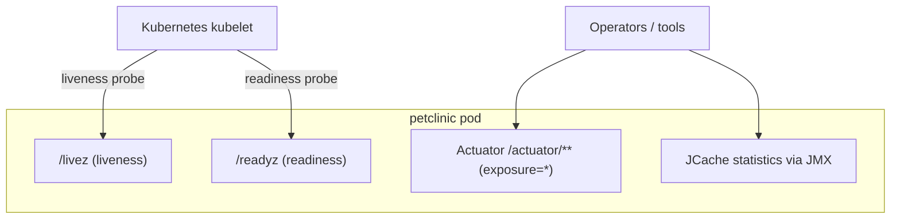

# Pattern: Health Probe & Management-Endpoint Exposure

## Status
Candidate — no explicit approval metadata or ADR exists in the repository to promote this pattern.

## Category
observability

## Problem
An orchestrated deployable needs the platform to know when it is alive and ready to serve traffic, and
operators need health/metrics/diagnostics endpoints — without building that plumbing by hand.

## Context
`petclinic` exposes Spring Boot **Actuator** management endpoints (health/info/metrics/etc.), with JCache
statistics surfaced via JMX. The Kubernetes deployment wires dedicated **liveness/readiness probes**
(`/livez`, `/readyz`) so the orchestrator can gate traffic and restarts. Actuator is exposed broadly
(`management.endpoints.web.exposure.include=*`) and the H2 console is enabled — both flagged by inline
config comments as development/testing conveniences; whether production restricts them is not evidenced
in-repo. There is **no** Micrometer metrics registry (e.g. Prometheus) and **no** distributed tracing
dependency.

## When to Use
- The service runs under an orchestrator that needs liveness/readiness signals.
- You want framework-provided health/metrics/diagnostics rather than hand-rolled endpoints.
- Operators need a standard management surface for the deployable.

## When Not to Use
- The runtime has no orchestrator/health-check consumer.
- A management surface must not be exposed at all (then it should be disabled, not merely present).

## Architecture Summary
`framework management endpoints (Actuator) + orchestrator probes (/livez, /readyz) + JMX cache stats`. The
orchestrator polls the probes to gate traffic/restarts; operators read Actuator for health/metrics.

## Structure / Flow

## Key Components
- **Actuator exposure** — `application.properties` `management.endpoints.web.exposure.include=*`; `pom.xml`
  `spring-boot-starter-actuator`.
- **Orchestrator probes** — `k8s/petclinic.yml` liveness `/livez`, readiness `/readyz`.
- **Cache statistics** — `system/CacheConfiguration.java` (`setStatisticsEnabled(true)`, JMX).

## Data / Event / API Contracts
- Actuator endpoints are framework-defined JSON contracts (not enumerated in application source).
- Probe endpoints return health status codes consumed by the orchestrator.
- No domain API/event contract.

## Naming Conventions
- Probes use the platform-conventional `/livez` and `/readyz` paths.
- Management endpoints live under `/actuator/**`.

## Service / Boundary Guidance
- Keep health/readiness semantics meaningful: readiness should reflect dependency availability (e.g. the
  active datastore), liveness should reflect process health only.
- Treat the broad Actuator exposure and H2 console as **operational surfaces to restrict at the edge in
  production** — they are dev/test conveniences here.

## Security / Compliance Considerations
- `include=*` with **no application authentication** exposes the full management surface; the H2 console is
  also enabled. Inline comments mark these dev/test-only, but production network restriction is **not
  evidenced in-repo** — a real exposure risk if carried to production.
- Restrict management/DB-console endpoints via ingress/network policy or Actuator security in production.

## Observability Considerations
- Health and JCache statistics are available, but there is **no metrics registry** (no Micrometer/Prometheus)
  and **no distributed tracing** — observability is partial. Adding a registry/exporter would make metrics
  externally scrapeable.
- Readiness gating prevents traffic to a not-yet-ready instance, improving deploy safety.

## Failure Handling
- Failing liveness triggers an orchestrator restart; failing readiness removes the instance from traffic
  until healthy.
- Poorly-scoped readiness (e.g. always-ready) defeats the purpose — tie it to real dependency checks.

## Trade-offs
- **Gains:** standard, low-effort health/metrics surface; orchestrator-native traffic/restart gating; cache stats via JMX.
- **Costs:** broad exposure is a security risk without edge restriction; no external metrics registry or
  tracing today; framework-defined endpoint set is not enumerated in source.

## Variants
- **Locked-down Actuator** — expose only `health`/`info` and secure the rest.
- **Metrics registry + exporter** (Micrometer → Prometheus) and **distributed tracing** (OpenTelemetry) for
  full observability — not present; would be pattern-update proposals.

## Anti-patterns
- Shipping `exposure.include=*` with the H2 console enabled to production without network restriction.
- Readiness that never fails, so the orchestrator cannot gate traffic during dependency outages.
- Assuming metrics are scrapeable when no registry/exporter is configured.

## Evidence
- **ADR:** None — no ADRs exist in the repository.
- **Repo:** `spring-petclinic`.
- **Service:** `petclinic`.
- **File:** `application.properties` (`management.endpoints.web.exposure.include=*`); `k8s/petclinic.yml`
  (`/livez`, `/readyz`); `system/CacheConfiguration.java` (JMX statistics); `pom.xml` (`spring-boot-starter-actuator`).
- **API/Event:** `GET /actuator/**` (`docs/architecture-inventory/baselines/api-inventory.md` E18); no events.
- **Deployment/Config:** liveness/readiness probes in the K8s manifest; H2 console enabled in config.
- **Notes:** No Micrometer registry or tracing dependency anywhere (architecture-baseline §6, capability-baseline §6 gaps).

## Related ADRs
None. No ADRs exist in the `spring-petclinic` repository.

## Related Patterns
- [Profile-Based Environment & Datastore Selection](../deployment/profile-based-environment-configuration.md)
- [Read-Through In-Process Cache for Read-Mostly Data](../data/read-through-in-process-cache.md)

## Recommendation
Keep orchestrator liveness/readiness probes and framework management endpoints, but **restrict the
management surface and H2 console in production** (edge/network policy or Actuator security) rather than
relying on `include=*`. Tie readiness to real dependency checks, and add a metrics registry/exporter and
tracing if observability requirements grow — each an explicit decision.

## Assumptions, Blockers & Open Questions

> [!IMPORTANT]
> This document contains unresolved items that require attention before or during implementation. Review and resolve before merging downstream artifacts.

### Assumptions
| # | Assumption | Rationale | Impact if Wrong | Validation Path |
|---|------------|-----------|-----------------|-----------------|
| A1 | Broad Actuator exposure and the H2 console are dev/test-only and restricted at the edge in production. | Inline comments in `application.properties` say so; no in-repo production override is visible. | If unrestricted in production, the full management surface and DB console are exposed unauthenticated. | Verify production ingress/network policy / Actuator security with the platform/security owner. |

### Open Questions
| # | Question | Why It Matters | Proposed Answer (if any) | Decision Owner |
|---|----------|----------------|--------------------------|----------------|
| Q1 | Should a metrics registry (Micrometer/Prometheus) and distributed tracing be added? | No external metrics/tracing exists today; limits operational insight. | Add if observability requirements demand it. | Platform / observability owner |
| Q2 | Do `/readyz` semantics include the active datastore's availability? | Readiness that ignores dependencies cannot gate traffic during a DB outage. | Confirm probe implementation reflects dependency health. | Platform / DevOps owner |
