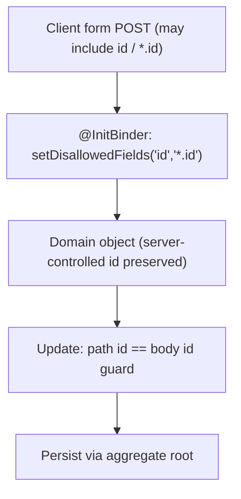

# Pattern: Data-Binding Field Allowlist (Mass-Assignment Protection)

## Status
Candidate — no explicit approval metadata or ADR exists in the repository to promote this pattern.

## Category
security

## Problem
When a web framework binds request parameters directly onto a domain object, a client can submit extra
fields (e.g. `id`, nested identifiers) that were never meant to be user-settable — a mass-assignment
tampering risk.

## Context
`petclinic` binds form submissions onto entity objects. To prevent tampering, the owner controller
registers an `@InitBinder` that **disallows** binding the `id` and any nested `*.id` fields
(`dataBinder.setDisallowedFields("id", "*.id")`), so a client-supplied identity cannot overwrite the
server-controlled one. The update flows additionally guard that the submitted owner id matches the path
id. This is a defensive input control; note the app has **no** application-level authentication/authorization.

## When to Use
- A framework binds request parameters onto persistent/domain objects.
- Certain fields (identity, ownership, audit, computed) must never be client-settable.
- You want an explicit binding policy rather than trusting that clients only send intended fields.

## When Not to Use
- Binding targets are purpose-built request DTOs that only contain user-settable fields (the DTO itself is
  the allowlist) — though a binder guard is still cheap defense-in-depth.

## Architecture Summary
An `@InitBinder` on the controller restricts which fields may be bound (`setDisallowedFields`), stripping
client-supplied identity/nested-id fields before they reach the domain object; a path/body id-match guard
backs it on updates.

## Structure / Flow

## Key Components
- **Binder allowlist** — `owner/OwnerController.java` `@InitBinder setAllowedFields(...)` calling
  `dataBinder.setDisallowedFields("id", "*.id")`.
- **Id-match guard on update** — owner update rejects a body id that does not match the path `ownerId`.
- **Applies at the mutation entry point** before persistence through the aggregate root.

## Data / Event / API Contracts
- The binding policy shapes which submitted fields are honoured; disallowed fields are ignored.
- No separate API/event contract; this is an input-binding control on the form endpoints.

## Naming Conventions
- Binder methods are `@InitBinder`-annotated and named for intent (e.g. `setAllowedFields`).
- Disallowed patterns use framework wildcard syntax (`*.id`) to cover nested identifiers.

## Service / Boundary Guidance
- Apply the binder policy on every controller that binds request data onto persistent objects, not just one.
- Prefer request DTOs for complex inputs, but keep the binder guard as defense-in-depth.
- Pair with the id-match guard so identity cannot be reassigned via the body on updates.

## Security / Compliance Considerations
- Directly mitigates mass-assignment/parameter-tampering on identity and nested-id fields.
- **Scope limit:** this is an *input-integrity* control, not access control. The repository has no
  authentication/authorization; this pattern does not substitute for an auth layer, which remains a gap.

## Observability Considerations
- Rejected/ignored fields are silent by default; if tamper attempts must be detected, add logging when
  disallowed fields are present in a submission.
- The id-mismatch guard is an observable rejection path distinguishable in logs.

## Failure Handling
- Disallowed fields are ignored during binding (the server value stands); no error is raised for their presence.
- An id mismatch on update is rejected and the user is returned to the form (not persisted).

## Trade-offs
- **Gains:** cheap, declarative protection against identity/nested-field tampering; keeps server-controlled
  fields authoritative.
- **Costs:** silent field-dropping can surprise developers; per-controller opt-in means a new controller can
  forget it; it is not a replacement for authentication/authorization.

## Variants
- **Explicit allowlist** (`setAllowedFields`) instead of a disallow list, for a stricter default.
- **DTO-per-request** binding where the DTO shape is the allowlist.

## Anti-patterns
- Binding request parameters straight onto entities with no field policy (mass-assignment exposure).
- Relying on this control as if it were access control.
- Applying the binder policy on some controllers but forgetting others.

## Evidence
- **ADR:** None — no ADRs exist in the repository.
- **Repo:** `spring-petclinic`.
- **Service:** `petclinic`.
- **File:** `owner/OwnerController.java` (`@InitBinder`, `setDisallowedFields("id", "*.id")`, id-match guard on update).
- **API/Event:** owner form endpoints (`docs/architecture-inventory/baselines/api-inventory.md` E3–E9); no events.
- **Deployment/Config:** n/a (application code).
- **Notes:** Catalogued as validation/behavioural constraints in capability-baseline §8 (C1); no Spring Security in-repo (architecture-baseline §5).

## Related ADRs
None. No ADRs exist in the `spring-petclinic` repository.

## Related Patterns
- [Post-Redirect-Get Form Handling with Bean Validation](../ui/post-redirect-get-form-validation.md)
- [Aggregate-Root Persistence via Spring Data JPA](../data/aggregate-root-persistence.md)

## Recommendation
Apply a data-binding field allowlist/disallow policy on every controller that binds request data onto
persistent objects, and keep the path/body id-match guard on updates. Treat it as defense-in-depth
alongside — not instead of — an authentication/authorization layer, which this repository currently lacks.

## Assumptions, Blockers & Open Questions

> [!IMPORTANT]
> This document contains unresolved items that require attention before or during implementation. Review and resolve before merging downstream artifacts.

### Assumptions
| # | Assumption | Rationale | Impact if Wrong | Validation Path |
|---|------------|-----------|-----------------|-----------------|
| A1 | The disallowed-fields binder policy is intended to be applied to all persistence-binding controllers. | It is present on the owner controller and is idiomatic for the framework; other controllers bind validated models similarly. | A controller that binds request data onto an entity without this guard would be exposed to mass-assignment. | Audit every `@Controller` that binds onto persistent objects for a binder policy. |

### Open Questions
| # | Question | Why It Matters | Proposed Answer (if any) | Decision Owner |
|---|----------|----------------|--------------------------|----------------|
| Q1 | Is application-level authentication/authorization planned? | This input control is not access control; the app is currently unauthenticated. | None in-repo; add if the deployment is not fully edge-protected. | Security / platform owner |
