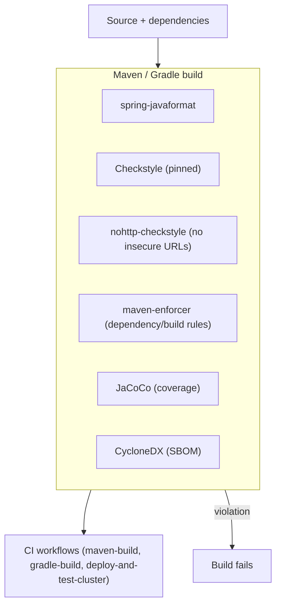

# Pattern: Build-Time Quality & Supply-Chain Gates

## Status
Candidate — no explicit approval metadata or ADR exists in the repository to promote this pattern.

## Category
testing

## Problem
Code style, formatting, insecure-URL, dependency-hygiene, and supply-chain concerns need to be enforced
consistently and automatically, so violations fail the build rather than depending on reviewer vigilance.

## Context
`petclinic` wires a set of quality and supply-chain gates into its Maven build (and mirrors the build in
CI): **Checkstyle** (pinned version) with a project config, **spring-javaformat** for formatting,
**nohttp-checkstyle** to forbid insecure `http://` URLs, the **maven-enforcer-plugin** for dependency/build
rules, **JaCoCo** for coverage instrumentation, and the **CycloneDX** plugin to generate an SBOM. GraalVM
native-image support and the SCSS (libsass) compile also run in the build. These run on both the Maven and
Gradle CI workflows, and a cluster deploy-and-test workflow applies the manifests to a kind cluster. The
gates are enforced by **build tooling and CI, not by ADRs** (there are none in-repo).

## When to Use
- You want objective, automated enforcement of style/format/security/dependency rules on every build.
- Supply-chain transparency (an SBOM) is required or valued.
- Consistency across contributors matters more than per-PR reviewer discretion.

## When Not to Use
- A throwaway prototype where build-gate overhead outweighs value.
- Rules that cannot be expressed as automated checks (those still need human review).

## Architecture Summary
`build lifecycle binds quality/supply-chain plugins → any violation fails the build → CI runs the same
build on push/PR`. The checks are declarative in the build file and reproduced in CI workflows.

## Structure / Flow

## Key Components
- **Style/format** — `maven-checkstyle-plugin` (Checkstyle pinned `12.3.1`, config under `src/checkstyle/`),
  `spring-javaformat-maven-plugin`.
- **Security hygiene** — `nohttp-checkstyle` (`nohttp-checkstyle-validation`, config `src/checkstyle/nohttp-checkstyle.xml`).
- **Build rules** — `maven-enforcer-plugin`.
- **Coverage** — `jacoco-maven-plugin`.
- **Supply chain** — `cyclonedx-maven-plugin` (SBOM); native-image via `native-maven-plugin`; SCSS via `libsass-maven-plugin`.
- **CI** — `.github/workflows/maven-build.yml`, `gradle-build.yml`, `deploy-and-test-cluster.yml`.

## Data / Event / API Contracts
- No runtime API/event contract. The "contract" is the set of enforced rules (style config, nohttp policy,
  enforcer rules) and the emitted SBOM artifact.

## Naming Conventions
- Check configs live under `src/checkstyle/` (`nohttp-checkstyle.xml`, config_loc expansion).
- Plugin versions are pinned via `<*.version>` properties for reproducibility.

## Service / Boundary Guidance
- Keep the same gates in the build file and CI so local and CI results match; do not let CI-only checks drift
  from the build.
- Since both Maven and Gradle are wired, keep their check sets aligned (or designate one canonical build).

## Security / Compliance Considerations
- **nohttp** prevents insecure `http://` references from entering the codebase.
- **CycloneDX SBOM** provides supply-chain transparency for dependency auditing/vulnerability tracking.
- The enforcer plugin can block banned/insecure dependencies as a policy point.

## Observability Considerations
- CI surfaces gate pass/fail per push/PR; JaCoCo reports coverage trends.
- The SBOM is a machine-readable inventory of shipped dependencies (Actuator can surface SBOM info).

## Failure Handling
- Any gate violation fails the build/CI, blocking merge/release until fixed (fail-closed).
- Pinned tool versions keep failures reproducible rather than shifting under floating versions.

## Trade-offs
- **Gains:** consistent automated enforcement, reduced reviewer burden, supply-chain transparency, reproducible builds.
- **Costs:** build-time overhead; occasional friction from strict checks; two build systems (Maven + Gradle)
  to keep aligned; coverage instrumentation cost.

## Variants
- **Single canonical build** (Maven *or* Gradle) to avoid dual-maintenance.
- **Additional gates** — dependency-vulnerability scanning, license checks, or mutation testing layered onto the same model.

## Anti-patterns
- Enforcing checks only in CI while local builds skip them (drift and surprise failures).
- Floating plugin versions that make failures non-reproducible.
- Letting the Maven and Gradle builds diverge in which gates they run.

## Evidence
- **ADR:** None — no ADRs exist in the repository.
- **Repo:** `spring-petclinic`.
- **Service:** `petclinic`.
- **File:** `pom.xml` (`maven-checkstyle-plugin` + Checkstyle `12.3.1`, `spring-javaformat-maven-plugin`,
  `nohttp-checkstyle`, `maven-enforcer-plugin`, `jacoco-maven-plugin`, `cyclonedx-maven-plugin`,
  `native-maven-plugin`, `libsass-maven-plugin`); `src/checkstyle/nohttp-checkstyle.xml`; `build.gradle`.
- **API/Event:** n/a.
- **Deployment/Config:** `.github/workflows/{maven-build,gradle-build,deploy-and-test-cluster}.yml`.
- **Notes:** Constraints are enforced by build tooling/CI, not ADRs (architecture-baseline §7).

## Related ADRs
None. No ADRs exist in the `spring-petclinic` repository.

## Related Patterns
- [Profile-Based Environment & Datastore Selection](../deployment/profile-based-environment-configuration.md)
- [Health Probe & Management-Endpoint Exposure](../observability/health-probe-and-management-endpoints.md)

## Recommendation
Keep style/format/nohttp/enforcer/coverage/SBOM gates bound to the build and mirrored in CI so violations
fail closed. Pin tool versions for reproducibility, and either designate one canonical build system or keep
Maven and Gradle gate sets explicitly aligned. Layer additional gates (dependency-vulnerability/license
scanning) onto the same model as needs grow.

## Assumptions, Blockers & Open Questions

> [!IMPORTANT]
> This document contains unresolved items that require attention before or during implementation. Review and resolve before merging downstream artifacts.

### Assumptions
| # | Assumption | Rationale | Impact if Wrong | Validation Path |
|---|------------|-----------|-----------------|-----------------|
| A1 | The Maven and Gradle builds enforce an equivalent set of gates. | Both are wired into CI (`maven-build.yml`, `gradle-build.yml`); the quality plugins are declared in `pom.xml`. | If the two builds diverge, a violation could pass on one path and fail on the other. | Diff the gate sets across `pom.xml` and `build.gradle`; designate a canonical build. |

### Open Questions
| # | Question | Why It Matters | Proposed Answer (if any) | Decision Owner |
|---|----------|----------------|--------------------------|----------------|
| Q1 | Is Maven or Gradle the canonical build/release path? | Both are wired; downstream SBOM/native-image automation and gate parity depend on the choice. | — | Platform build owner |
| Q2 | Should dependency-vulnerability scanning be added alongside the SBOM? | The SBOM inventories dependencies but does not by itself flag known vulnerabilities. | Add a scanner (e.g. consuming the CycloneDX SBOM) if supply-chain risk management requires it. | Security / platform owner |
