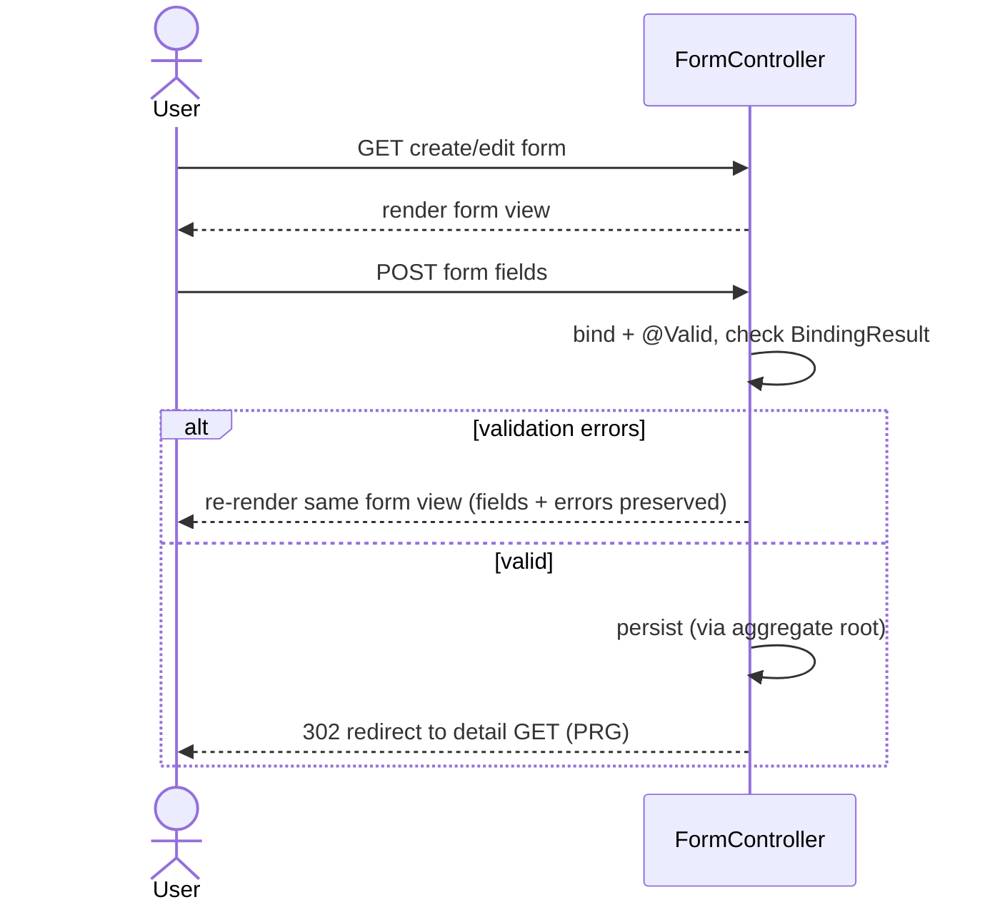

# Pattern: Post-Redirect-Get Form Handling with Bean Validation

## Status
Candidate — no explicit approval metadata or ADR exists in the repository to promote this pattern.

## Category
ui

## Problem
Server-rendered forms need to (a) validate user input server-side, (b) show field-level errors without
losing the user's entries, and (c) avoid duplicate submissions from browser refresh/back after a
successful write.

## Context
Every create/update flow in `petclinic` follows the same shape: a `GET` renders the form; a `POST`
binds the submitted fields to a model object, runs Bean Validation, and either **re-renders the same form
with `BindingResult` errors** (failure) or performs the write and **redirects (302) to a GET** on the
result page (success). This is applied consistently across owner, pet, and visit forms.

## When to Use
- Any server-rendered create/update form.
- You want a single, predictable submit contract with server-side validation and no lost input on error.
- You need to prevent duplicate writes on refresh/back navigation.

## When Not to Use
- Purely client-driven forms that submit via async calls and manage their own error UI.
- Idempotent operations where the redirect adds no value.

## Architecture Summary
`GET form → POST (bind + `@Valid` + `BindingResult`) → {errors: re-render form view} | {ok: mutate + 302
redirect to detail GET}`. Binder rules restrict which fields may be bound (see
[Data-Binding Field Allowlist](../security/data-binding-field-allowlist.md)).

## Structure / Flow

## Key Components
- **Form controllers** — `owner/OwnerController` (create/edit owner), `owner/PetController` (add/edit pet),
  `owner/VisitController` (new visit).
- **Validated model objects** — `Owner` (`@NotBlank`, telephone `@Pattern("\\d{10}")`), `Pet` (`@NotBlank`
  name), `Visit` (`@NotBlank` description; future date), plus the custom `PetValidator`.
- **`BindingResult`-driven re-render** on failure; `redirect:/owners/{id}` on success.

## Data / Event / API Contracts
- Request: form-encoded fields bound to the model object.
- Response: `200` re-render of the form view on error; `302` redirect to a detail `GET` on success.
- Errors are surfaced as field errors in the re-rendered view — there is no JSON error body for these
  view endpoints (documented in the API inventory).

## Naming Conventions
- Paired routes `GET`/`POST` on the same path (`/owners/new`, `/owners/{ownerId}/edit`, `.../pets/new`,
  `.../visits/new`).
- Success redirects target the canonical detail route (`redirect:/owners/{ownerId}`).
- Custom validators named `<Entity>Validator`; validation messages via field-error codes
  (`required`, `duplicate`, `typeMismatch.*`).

## Service / Boundary Guidance
- Keep validation declarative on the model (`@NotBlank`, `@Pattern`) and reserve custom `Validator`
  classes for cross-field/business rules (`PetValidator`).
- Perform the write through the aggregate root (see
  [Aggregate-Root Persistence](../data/aggregate-root-persistence.md)) inside the success branch only.

## Security / Compliance Considerations
- Server-side validation is authoritative; never trust client-side checks alone.
- Combine with the binder allowlist so submitted `id`/nested fields cannot be mass-assigned (see the
  security pattern). The owner-update flow also guards that the submitted id matches the path id.

## Observability Considerations
- Success and validation-failure branches are distinguishable in request logs (redirect vs re-render).
- No dedicated form-conversion metrics exist; add counters if funnel analysis is required.

## Failure Handling
- Validation failure: re-render with `BindingResult` errors, preserving user input.
- Persistence-time constraint violation (e.g. duplicate pet name) is caught and re-surfaced as a field
  error rather than a 500 — see [Layered Uniqueness Enforcement](../data/layered-uniqueness-enforcement.md).
- ID/path mismatch on update is rejected and returned to the form.

## Trade-offs
- **Gains:** no duplicate submits on refresh, preserved input on error, one consistent submit contract,
  authoritative server validation.
- **Costs:** an extra redirect round-trip on success; error state is per-request (not a rich client UX).

## Variants
- **PRG with flash attributes** to carry a success message across the redirect.
- **Async/JSON form submission** for client-driven UIs (a different pattern, not used here).

## Anti-patterns
- Returning the detail view directly from the `POST` (no redirect), which causes duplicate submissions on refresh.
- Relying only on client-side validation.
- Rendering a generic error page on validation failure instead of re-rendering the form with field errors.

## Evidence
- **ADR:** None — no ADRs exist in the repository.
- **Repo:** `spring-petclinic`.
- **Service:** `petclinic`.
- **File:** `owner/OwnerController.java` (create/edit, `BindingResult`, `redirect:/owners/{id}`, id-mismatch guard),
  `owner/PetController.java`, `owner/VisitController.java`; `owner/Owner.java` (`@NotBlank`, telephone `@Pattern`),
  `owner/Pet.java`, `owner/Visit.java`, `owner/PetValidator.java`.
- **API/Event:** owner/pet/visit form endpoints (`docs/architecture-inventory/baselines/api-inventory.md` E3–E15); no events.
- **Deployment/Config:** n/a (application code).
- **Notes:** Behavioural constraints (blank fields, 10-digit phone, id mismatch) catalogued in capability-baseline §8.

## Related ADRs
None. No ADRs exist in the `spring-petclinic` repository.

## Related Patterns
- [Server-Rendered MVC with Template Views](server-rendered-mvc-views.md)
- [Data-Binding Field Allowlist (Mass-Assignment Protection)](../security/data-binding-field-allowlist.md)
- [Layered Uniqueness Enforcement](../data/layered-uniqueness-enforcement.md)

## Recommendation
Adopt PRG + server-side Bean Validation as the default for every new server-rendered form. Keep field
validation declarative on the model and push cross-field/business rules into a dedicated `Validator`.
Always redirect on success and re-render on error.

## Assumptions, Blockers & Open Questions

> [!IMPORTANT]
> This document contains unresolved items that require attention before or during implementation. Review and resolve before merging downstream artifacts.

### Assumptions
| # | Assumption | Rationale | Impact if Wrong | Validation Path |
|---|------------|-----------|-----------------|-----------------|
| A1 | PRG is applied deliberately as the standard form contract, not incidentally. | All create/update controllers use `redirect:` on success and re-render on error identically. | If a JSON/async form approach is intended for new UIs, this guidance would not apply. | Confirm form-handling standard with the UI/architecture owner. |

### Open Questions
| # | Question | Why It Matters | Proposed Answer (if any) | Decision Owner |
|---|----------|----------------|--------------------------|----------------|
| Q1 | Should success flows carry flash messages across the redirect for user feedback? | Improves UX consistency for confirmations. | Not currently used; optional enhancement. | UI / product owner |
