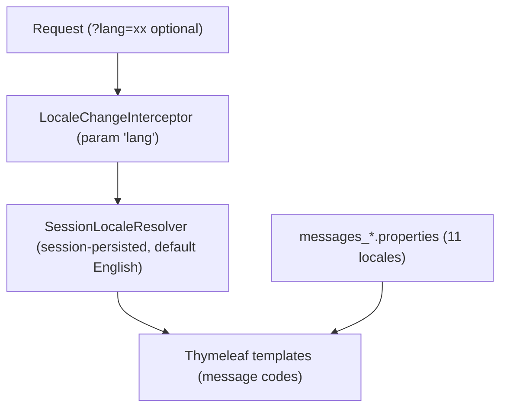

# Pattern: Request-Scoped Internationalization

## Status
Candidate — no explicit approval metadata or ADR exists in the repository to promote this pattern.

## Category
ui

## Problem
A web UI must render in the user's language and remember that choice across requests, without hard-coding
strings into templates or scattering locale logic through controllers.

## Context
`petclinic` supports 11 locales. A user selects a language via a `?lang=` query parameter, which a
`LocaleChangeInterceptor` reads on each request; a `SessionLocaleResolver` persists the choice in the HTTP
session (defaulting to English). All display strings are externalized into `messages_*.properties` bundles
keyed by locale, and templates reference message codes rather than literal text. The locale mechanism is
localized in one configuration class (`WebConfiguration`).

## When to Use
- The UI must be presented in multiple languages.
- Language should be switchable per request and remembered per user session.
- You want all display strings externalized into resource bundles for translation.

## When Not to Use
- The application is single-locale and translation is out of scope.
- Locale must be derived from authenticated user profile/tenant settings rather than a request parameter
  (a different resolver strategy applies).

## Architecture Summary
A locale-change interceptor reads the `?lang=` parameter each request; a session-scoped locale resolver
stores and supplies the active locale; templates resolve text from per-locale message bundles.

## Structure / Flow

## Key Components
- **Configuration** — `system/WebConfiguration.java` (`localeResolver()` = `SessionLocaleResolver` default
  English; `localeChangeInterceptor()` with param name `lang`; registered in `addInterceptors`).
- **Message bundles** — `src/main/resources/messages/messages_*.properties` (de, en, es, fa, hi, ja, ko, pt,
  ru, tr + default).
- **Templates** — reference message codes rather than literal strings.

## Data / Event / API Contracts
- The only external "contract" is the `?lang=<locale>` query parameter and the set of message keys.
- No API/event contract; locale state is server-side session, not a client token.

## Naming Conventions
- Bundles named `messages_<locale>.properties`; the switch parameter is `lang`.
- Message keys are stable, namespaced by feature/area; templates use keys, never inline copy.

## Service / Boundary Guidance
- Keep locale wiring centralized in one web-config class; do not read the `lang` parameter ad hoc in controllers.
- Store the resolved locale server-side (session) rather than passing it to a client store (consistent with
  the server-rendered UI pattern).

## Security / Compliance Considerations
- The `lang` value should map only to known bundles; unknown values fall back to the default locale (no
  injection risk from arbitrary values).
- No sensitive data is involved in locale selection.

## Observability Considerations
- The active locale is a request/session attribute; log or tag it if per-locale behaviour needs analysis.
- Missing translation keys surface as raw codes in the UI — a lightweight signal that a bundle is incomplete.

## Failure Handling
- An unrecognized `lang` value defaults to English (graceful fallback).
- A missing message key renders the code itself rather than failing the request.

## Trade-offs
- **Gains:** clean separation of copy from templates, per-request switching, per-session persistence,
  centralized configuration.
- **Costs:** bundles must be kept in sync across locales; session-stored locale is not shared across
  devices/sessions; request-parameter switching is not tied to a user profile.

## Variants
- **Cookie- or header-based locale resolution** (e.g. `Accept-Language`) instead of session + query param.
- **Profile/tenant-driven locale** resolved from authenticated user settings (requires an auth/identity layer, absent here).

## Anti-patterns
- Hard-coding display strings in templates or controllers.
- Reading the `lang` parameter directly in controllers instead of via the interceptor/resolver.
- Letting locale bundles drift out of sync so keys exist in some languages but not others.

## Evidence
- **ADR:** None — no ADRs exist in the repository.
- **Repo:** `spring-petclinic`.
- **Service:** `petclinic`.
- **File:** `system/WebConfiguration.java` (`SessionLocaleResolver`, `LocaleChangeInterceptor` param `lang`,
  `addInterceptors`); `src/main/resources/messages/messages_*.properties`.
- **API/Event:** `?lang=` query parameter across view endpoints; no events.
- **Deployment/Config:** n/a (application code + resource bundles).
- **Notes:** 11-locale coverage confirmed in capability-baseline §1 (C5) and architecture-baseline §4.

## Related ADRs
None. No ADRs exist in the `spring-petclinic` repository.

## Related Patterns
- [Server-Rendered MVC with Template Views](server-rendered-mvc-views.md)
- [Post-Redirect-Get Form Handling with Bean Validation](post-redirect-get-form-validation.md)

## Recommendation
Use centralized request-scoped locale resolution with externalized message bundles for any multi-language
UI. Keep the locale wiring in one config class, validate `lang` against known bundles, and add a check that
message keys stay in sync across locales. Switch to header/profile-based resolution only if requirements
demand it.

## Assumptions, Blockers & Open Questions

> [!IMPORTANT]
> This document contains unresolved items that require attention before or during implementation. Review and resolve before merging downstream artifacts.

### Assumptions
| # | Assumption | Rationale | Impact if Wrong | Validation Path |
|---|------------|-----------|-----------------|-----------------|
| A1 | Query-parameter + session locale resolution is the intended i18n strategy (not pending replacement by profile/tenant-driven locale). | `WebConfiguration` uses `SessionLocaleResolver` + `LocaleChangeInterceptor`; no auth/identity layer exists. | If locale should follow an authenticated profile/tenant, the resolver strategy would change. | Confirm i18n strategy with the UI/architecture owner. |

### Open Questions
| # | Question | Why It Matters | Proposed Answer (if any) | Decision Owner |
|---|----------|----------------|--------------------------|----------------|
| Q1 | Is there a process to keep the 11 message bundles synchronized as new keys are added? | Missing keys render as raw codes, degrading localized UX. | No automated check evidenced; add a key-parity test. | UI / localization owner |
