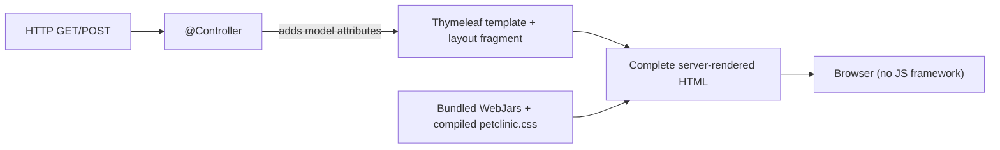

# Pattern: Server-Rendered MVC with Template Views

## Status
Candidate — no explicit approval metadata or ADR exists in the repository to promote this pattern.

## Category
ui

## Problem
A form-and-list web application needs a user interface without the complexity, build tooling, and client
state management of a single-page-application (SPA) framework.

## Context
`petclinic` renders its entire UI on the server. Spring MVC `@Controller`s return **Thymeleaf** template
view names; the server produces a complete HTML page per request. Shared chrome comes from layout
fragments, styling is delivered via WebJars (Bootstrap, font-awesome) with SCSS compiled to CSS at build
time, and there is **no** `package.json`, npm/webpack/Vite build, or client-side JS framework anywhere in
the repository. Context passes from server to client embedded directly in the rendered HTML — there is no
client-side state store or hydration payload.

## When to Use
- The UI is primarily forms, lists, and detail pages with modest client-side interactivity.
- You want a single build/deploy artifact and no separate frontend toolchain.
- SEO-friendly, fully-rendered HTML and simple progressive enhancement are sufficient.
- The team is server-centric and wants to avoid client state management.

## When Not to Use
- The UI is highly interactive/stateful (rich client-side workflows, real-time updates, offline).
- A separate frontend team must own and deploy the UI independently.
- A component-based design system or micro-frontend composition is required.

## Architecture Summary
Controller returns a view name → the template engine renders a full HTML page using model attributes and
shared layout fragments → static assets (bundled WebJars + compiled CSS) are served from the deployable.
No JSON-to-client hydration; model data is rendered inline.

## Structure / Flow

## Key Components
- **MVC controllers** returning view names — `owner/*Controller`, `vet/VetController`, `system/WelcomeController`.
- **Templates + shared layout** — `src/main/resources/templates/**`, `templates/fragments/layout.html`.
- **Styling pipeline** — Bootstrap/font-awesome WebJars + SCSS in `src/main/scss/*` compiled to
  `petclinic.css` at build time (libsass).

## Data / Event / API Contracts
- View endpoints have **no machine-readable contract**; the "response" is a resolved view name/redirect.
- Model attributes bound by the controller are the implicit template contract (e.g. `listOwners`,
  `currentPage`, `totalPages`).
- Where a machine contract is also needed, pair with
  [Content-Negotiated Dual Representation](../integration/content-negotiated-dual-representation.md).

## Naming Conventions
- View names are path-like and match the template location (`owners/ownersList`, `pets/createOrUpdatePetForm`,
  `vets/vetList`, `welcome`).
- Form templates use a shared `createOrUpdate<Entity>Form` naming convention.
- Model attribute names are stable, lowerCamelCase, and reused across templates.

## Service / Boundary Guidance
- Keep rendering in the presentation layer (controllers + templates); do not leak persistence types into
  templates beyond what the model exposes.
- Shared chrome belongs in layout fragments, not duplicated per page.
- The UI is part of the single deployable — there is no separate UI service boundary here.

## Security / Compliance Considerations
- Server-side rendering means output escaping is handled by the template engine (mitigates reflected XSS
  when defaults are respected).
- There is no client-held token or session store; the locale is held server-side (see
  [Request-Scoped Internationalization](request-scoped-localization.md)). No application auth exists in-repo.

## Observability Considerations
- Page renders are ordinary request handling — standard server request logging/metrics apply.
- No client-side telemetry exists; any RUM/analytics would be a new concern.

## Failure Handling
- Validation failures re-render the same form with field errors (see
  [Post-Redirect-Get Form Handling with Bean Validation](post-redirect-get-form-validation.md)).
- Unhandled exceptions render the framework default `error` view (HTML clients) — no custom
  `ErrorController`/`@ControllerAdvice` is present.

## Trade-offs
- **Gains:** one artifact, no frontend build, SEO-friendly full HTML, simple mental model, output escaping by default.
- **Costs:** limited rich interactivity; full-page navigation; server does rendering work; harder to reuse the
  UI across multiple clients than a JSON API.

## Variants
- **Server-rendered + progressive enhancement** (small unobtrusive JS) for targeted interactivity.
- **Hybrid** — server-rendered pages plus a few JSON endpoints for machine clients (already present via the
  vet data endpoint).

## Anti-patterns
- Smuggling business logic into templates instead of controllers/services.
- Fetching static assets from an external CDN when the deployable is meant to be self-contained (this app
  bundles WebJars deliberately).
- Duplicating page chrome instead of using shared layout fragments.

## Evidence
- **ADR:** None — no ADRs exist in the repository.
- **Repo:** `spring-petclinic`.
- **Service:** `petclinic`.
- **File:** `owner/*Controller.java`, `vet/VetController.java`, `system/WelcomeController.java`;
  `src/main/resources/templates/**`, `templates/fragments/layout.html`; `src/main/scss/*`; `pom.xml` (WebJars, libsass).
- **API/Event:** view endpoints (`docs/architecture-inventory/baselines/api-inventory.md` Part 1); no events.
- **Deployment/Config:** static assets bundled into the deployable (no external CDN).
- **Notes:** No `package.json` / npm / webpack / React-Angular-Vue dependency anywhere (architecture-baseline §4, ui-inventory).

## Related ADRs
None. No ADRs exist in the `spring-petclinic` repository.

## Related Patterns
- [Post-Redirect-Get Form Handling with Bean Validation](post-redirect-get-form-validation.md)
- [Request-Scoped Internationalization](request-scoped-localization.md)
- [Content-Negotiated Dual Representation](../integration/content-negotiated-dual-representation.md)

## Recommendation
Keep server-side rendering for the form/list/detail UI while interactivity requirements stay modest. If a
richly interactive or independently deployed UI becomes a requirement, treat the shift to an SPA/MFE as an
architecture decision (ADR) and a pattern-update proposal — do not partially bolt on a client framework
without that decision.

## Assumptions, Blockers & Open Questions

> [!IMPORTANT]
> This document contains unresolved items that require attention before or during implementation. Review and resolve before merging downstream artifacts.

### Assumptions
| # | Assumption | Rationale | Impact if Wrong | Validation Path |
|---|------------|-----------|-----------------|-----------------|
| A1 | Server-side rendering is the intended UI approach, not a legacy state pending SPA migration. | No client framework or build exists in-repo; the pattern is applied uniformly. | If an SPA/MFE migration is planned, guidance here would conflict with target state. | Confirm UI direction with the platform/architecture owner. |

### Open Questions
| # | Question | Why It Matters | Proposed Answer (if any) | Decision Owner |
|---|----------|----------------|--------------------------|----------------|
| Q1 | Is any client-side interactivity roadmap expected that would justify progressive enhancement or an SPA? | Determines whether to keep pure SSR or invest in a client toolchain. | None evidenced in-repo. | Product / UX owner |
